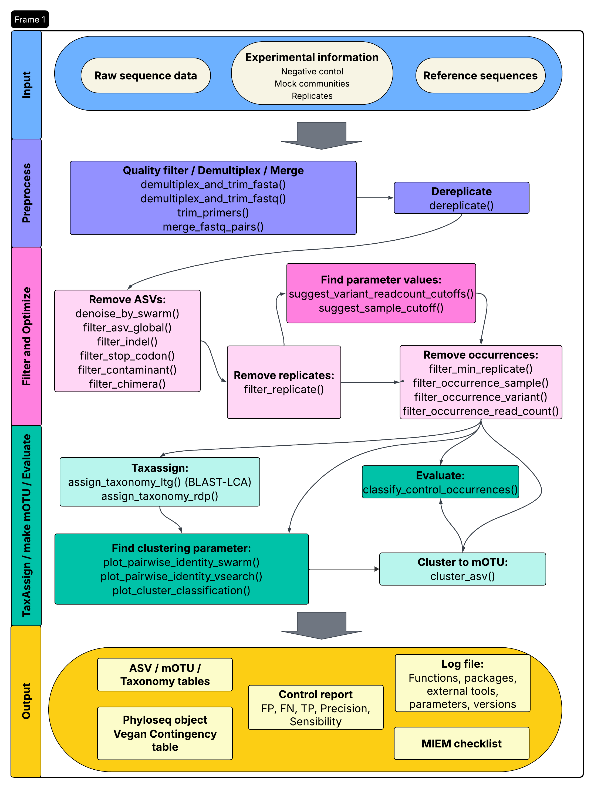

<style>
/* Block console output (<pre>) scrolls horizontally AND vertically */
pre {
  white-space: pre !important;        /* preserve spacing, no wrapping */
  overflow-x: auto !important;        /* horizontal scroll */
  overflow-y: auto !important;        /* vertical scroll */
  display: block;
  max-width: 100%;
  max-height: 500px;                  /* adjust height limit if you want */
  box-sizing: border-box;
}

/* Ensure code inside <pre> also stays fixed and scrollable */
pre code {
  white-space: pre !important;
}

/* TABLES: prevent wrapping, allow horizontal AND vertical scroll */
table {
  display: block;
  overflow-x: auto !important;
  overflow-y: auto !important;
  white-space: nowrap;                /* no wrapping of table cells */
  max-width: 100%;
  max-height: 500px;                  /* adjust as you like */
  box-sizing: border-box;
}
</style>


```{r, include = FALSE}
knitr::opts_chunk$set(
  collapse = TRUE,
  message = TRUE,
  warning = TRUE,
  echo=TRUE,
  eval=TRUE,
  cache=FALSE,
  fig.width = 6,
  out.width = '100%',
  comment = "#>"
)
```

**Package version:** `r packageVersion("vtamR")`

**vtamR** is an advanced, R-based revision of 
[VTAM](https://spj.science.org/doi/pdf/10.1016/j.csbj.2023.01.034) 
(Validation and Taxonomic Assignment of Metabarcoding Data). 
It provides a **comprehensive metabarcoding pipeline**, enabling:

- **End-to-End Sequence Analysis:** Processes raw FASTQ files of amplicon 
sequences to generate a validated 
[Amplicon Sequence Variant (ASV)](https://meglecz.github.io/vtamR/articles/tutorial-vtamr-pipeline.html#glossary) table, 
with ASVs assigned to taxonomic groups.
- **Replicate Handling:** Supports technical or biological replicates of the same sample.
- **Control-Based Filtering:** Uses positive and negative control samples to refine 
filtering, minimizing both [false positives](https://meglecz.github.io/vtamR/articles/tutorial-vtamr-pipeline.html#glossary) and [false negatives](https://meglecz.github.io/vtamR/articles/tutorial-vtamr-pipeline.html#glossary).


**Novelties Compared to VTAM**

- **Modular Design:** As a series of R functions, `vtamR` is **highly adaptable**, 
allowing users to include, exclude, or reorder analysis steps as needed.
- **More Flexible Preprocessing:** Demultiplexing and subsampling of FASTA or FASTQ pairs.
- **Denoising with SWARM:** Incorporates SWARM for robust denoising
of amplicon sequence variants (ASVs).
- **Post-Processing of Swarms:** Splits swarms among abundant ASVs to prevent 
pooling of highly similar yet distinct ASVs, preserving **intra-specific variability**.
- **Visualization Tools:** Offers **graphic options** to aid in data interpretation and decision-making.
- **Filtering Statistics:** Includes functions to generate **statistics for each filtering step** 
(e.g., read and variant counts).
- **ASV Clustering into mOTUs:**
  - Uses **VSEARCH or SWARM** to cluster ASVs into molecular operational taxonomic units (mOTUs).
  - Provides visualization tools to help users **select optimal clustering parameters**.
- **Simplified Workflow:** The concepts of "marker" and "run" have been removed to streamline analyses.
- **Detailed Log File:** Records all major functions called, along with their parameters and runtimes.
- **Summary Information:** Facilitates publication of results (e.g., MIEM checklist).
- **Flexible Output:** Formats output for direct use with `phyloseq` or `vegan`.


```{r, out.width="100%", fig.align="center", echo=FALSE, fig.cap="Overview of the vtamR Workflow"}

```


# Set up

**Please, follow the [Installation](installation.html) instructions before starting this tutorial.**

This a detailed, tutorial. 
**For impatient users, see the [Short tutorial](short-tutorial.html).**

> **Before beginning your analysis, review the [Tips – Good to Know](#tips---good-to-know) section.**
> This section highlights key features and options of `vtamR`, 
helping you run the functions more effectively.


## Load Library
```{r setup}
library(vtamR)
library(dplyr)
```

## Set Paths to Third-Party Programs {#set-path}

R can execute external programs directly if their executables 
are available in your system's `PATH` (see [Installation](installation.html)).

If an executable is not in your `PATH`, you must tell R where to find it. 
There are two ways to do this.

The first option is to provide the path to the executable using the `xxx_path`
(e.g. `vsearch_path`, `cutadapt_path`) argument of each function that calls an 
external program. Although this approach works, it can become tedious, 
especially when the same program is used in several functions.

A simpler approach is to set a package option for each executable. 
Once these options have been declared, usually at the beginning of your script, 
`vtamR` can use them automatically. You will then no longer need to provide 
the corresponding `xxx_path` argument in each function call.

For example:

```{r, eval=FALSE}
options(vtamR.vsearch_path = "C:/Users/Public/vsearch-2.23.0-win-x86_64/bin/vsearch")
options(vtamR.blast_path = "C:/Users/Public/blast-2.16.0+/bin/blastn")
options(vtamR.cutadapt_path = "C:/Users/Public/cutadapt")
options(vtamR.swarm_path = "C:/Users/Public/swarm-3.1.5-win-x86_64/bin/swarm")
options(vtamR.pigz_path = "C:/Users/Public/pigz-win32/pigz")
```

In this example, the paths are configured for Windows. Replace them with the actual 
locations of the programs on your computer. To configure these options, 
locate the vsearch.exe, blastn.exe, cutadapt.exe, swarm.exe, and pigz.exe files, 
and specify their paths without the .exe extension.

## Input Data

### Data Structure and Workflow

*Dataset Composition*

Sequences are typically derived from **96 samples**, corresponding to a 96-well 
plate used for PCR amplification.

Each plate includes **negative controls, mock samples, and biological samples**.
A single sequencing library is generated per replicate, with each library 
representing a set of 96 PCR reactions.

While `vtamR` can analyze datasets **without controls or replicates**, 
its full potential is realized when these features are utilized:

- **Controls** enable rigorous data filtering based on control sample content, 
  reducing false positives and negatives.
- **Replicates** ensure reproducibility and minimize technical variability.


For projects exceeding 96 samples, analyses are conducted **plate by plate**.

- Consistent use of control samples ensures **comparability** across different 
libraries or time points (e.g., longitudinal studies tracking the same sites over time).
- Filtered datasets can be **pooled** using the `pool_dataset()` 
function for integrated analysis.


*Multi-Marker Analysis*

`vtamR` supports the analysis of the same samples using 
**multiple, strongly overlapping markers**. For example, our dataset 
originates from a project 
[Corse et al., 2017](https://onlinelibrary.wiley.com/doi/10.1111/1755-0998.12703) 
utilizing two markers: **MFZR** and **ZFZR**.

Both markers target overlapping regions of the **COI gene**, where
**MFZR** starts **18 nucleotides upstream** of **ZFZR**.


### Demo Dataset

The demo files provided in the `vtamR` package include:

- **2 real samples**
- **1 mock sample**
- **1 negative control**

for each **marker-plate combination**. Due to the limited sample size, 
numerical values and graphs may not be highly informative.

Results from different **marker-plate combinations** are stored in 
**separate directories**, each maintaining the same structure and filenames. 
These data sets are processed independently using the same pipeline.

We will first analyze the **first "plate" of the MFZR marker**, 
then demonstrate how to **pool results** from different plates and markers.

*Loading Data*

To load the **demo files included in `vtamR`**, we will use the `system.file()` function.
For your own datasets, specify the file and directory paths (e.g., `~/vtamR/fastq`).

```{r set-demo-file}
fastq_dir <- system.file("extdata/demo/fastq", package = "vtamR")
fastqinfo <-  system.file("extdata/demo/fastqinfo_mfzr_plate1.csv", package = "vtamR")
mock_ncbi_fasta <- system.file("extdata/demo/mock_ncbi.fasta", package = "vtamR")
asv_list <-  system.file("extdata/demo/asv_list.csv", package = "vtamR")
```


- **`fastq_dir`:** Directory containing the input FASTQ files.
- **[`fastqinfo`](#fastqinfo):** CSV file with metadata for input files, 
including primers, tags, and sample information.
- **`mock_ncbi_fasta`:** FASTA file containing COI sequences of species 
present in the mock samples.
  - *Note:* These sequences may not be trimmed to the marker region and can 
  slightly differ from the ASVs in the mock samples.
  - *Purpose:* Used to identify which ASVs correspond to expected species 
  in the mock, facilitating the creation of a [`mock_composition`](#mock_composition) 
  file that defines the expected content of mock samples.
- **[`asv_list`](#asv_list):** *(Optional)* CSV file containing ASVs and 
`asv_id`s from previous data sets.

### Database for Taxonomic Assignment

To perform taxonomic assignment, set the path to:

- The **database** for taxonomic assignment (`blast_db`).
- The **accompanying taxonomy file** (`taxonomy`).

For this example, we use a **small demo database** included in the `vtamR` package.

To obtain a **full reference database** (for real data), visit the [TaxAssign Reference Database](installation.html#taxassign-reference-data-base) section.

When using your own data, provide the file names directly, **without** using the `system.file()` function.

```{r set_db}
taxonomy <- system.file("extdata/db_test/taxonomy_reduced.tsv", package = "vtamR")
blast_db <- system.file("extdata/db_test", package = "vtamR")
blast_db <- file.path(blast_db, "COInr_reduced")
```


### Check the Format of Input Files

The `check_file_info()` function:

- Verifies that all **required columns** are present in your input files.
- Performs **sanity checks** to detect potential errors.

It is optional, but useful, as user-generated files may contain subtle 
errors that are difficult to identify manually.

```{r check-fileinfo}
check_file_info(file = fastqinfo, dir = fastq_dir, file_type = "fastqinfo")
check_file_info(file = asv_list, file_type = "asv_list")
```

## Output directory

Let’s set the **output directory** for **plate 1 of MFZR**.

```{r general-parameters}
outdir <- file.path("vtamR_demo_out", "mfzr_plate1")
```

## Set the log file

`vtamR` automatically generates a log file that records every major function called during an analysis. For each function call, the log includes:

* all arguments and their values, including default values that were not explicitly specified;
* the start and end time of the call; and
* the function's runtime.

This log is extremely valuable for reproducibility. It lets you reconstruct exactly how an analysis was performed, even years later, even if the original script has been lost or modified. In effect, the log file is a complete record of your analysis workflow.

**Two ways to set the log path**

Just like for external program paths, there are two ways to set the log path.

*Option 1: Pass `log_file` to each function call.*
You can specify the path to the log file directly, using the `log_file` argument of each major `vtamR` function. This works, but it's a bit laborious — it's easy to forget the argument on some calls, or to accidentally use different filenames across calls, which leaves you with several files that each contain only part of the information.

*Option 2: Set a package-level option once (recommended).*
A much simpler approach is to define the log path once, as a package option, at the start of your script. From then on, every logged function call is automatically appended to the same file — you don't need to specify anything else. This does mean the log will accumulate every trial and attempt, which can get a bit messy, but you'll always have the complete picture of what you did.

For all functions with a `log_file` argument, the log path is resolved in the following order of priority:

1. the `log_file` argument, if it is provided in the function call;
2. the `vtamR.log_file` package option, if it has been set;
3. a default file, `vtamR_log.csv`, written to the working directory.

We strongly recommend using the package option, and that's what we'll do in this tutorial.

Define the path to the log file as a package option:

```{r set-log-file}
options(vtamR.log_file = file.path(outdir,  "run_info", "vtamR_log.csv"))
```

From this point on, every call to a `vtamR` function that supports logging will have its details appended to this file automatically.

*A tip for finalized pipelines*

Once your pipeline is finalized, consider archiving the log file from your testing phase, then running the final pipeline with a fresh `log_file`. This gives you a clean, complete record of the exact procedure and parameters used to produce your final results — long after the analysis is done. It's also the input for the `miem_bioinfo()` function, which extracts information from the log file to help you prepare documentation for publication (e.g., a MIEM checklist).

Using the log file comes with only a minor requirements — well worth the benefit of fully reproducible analyses:

*Always name arguments explicitly when calling a function* — for example, use `my_function(input = my_file)` rather than relying on positional matching (`my_function(my_file)`).


# Pre-process reads

Your FASTQ files may vary depending on your laboratory and sequencing setup. They may include:

* **Multiple [sample replicates](#glossary)**
* **[Tags](#glossary)** for [demultiplexing](#glossary)
* **Primer sequences**

The pre-processing steps applied to the reads, as well as their order, may also vary depending on your experimental design.

See [From FASTQ to data frame](from-fastq-to-df.html) for examples of how to handle different experimental designs and how to change the order of merging and demultiplexing steps.
 
## Count reads in input FASTQ files

Let's count the number of input sequences in each input FASTQ file pair.

In the following `count_reads_batch()` function 

* The files listed in the `fastq_fw` column of `fastqinfo` are examined.
  **[fastqinfo](#fastqinfo)** can be either a CSV file or a data frame 
  containing information about the input files, primers, tags, samples, and other experimental metadata.
* The input FASTQ files are located in `dir`.
* The updated `fastqinfo` table, completed with the read count for each input 
file pair, is written to `outfile`.
* The function returns the `fastqinfo` data frame completed by read counts.

For more information, see `?count_reads_batch`.

```{r count_reads}
fastqinfo_rc_file <- file.path(outdir, "fastqinfo_rc.csv")
          
          
fastqinfo_rc <- count_reads_batch(
  info = fastqinfo,
  dir = fastq_dir, # directory of input fastq files
  outfile = fastqinfo_rc_file # file path for the updated fastqinfo
)

knitr::kable(select(fastqinfo_rc, sample, fastq_fw, read_count), format = "markdown")
```

## Randomly subsample sequencing reads

This step can be useful for balancing read counts across your sequencing libraries. 
It is optional, but may help ensure that replicates have similar numbers of reads.

The `random_sample_batch` function allows you to randomly subsample reads from
FASTA files or FASTQ file pairs listed in a CSV file or data frame, 
such as your `fastqinfo_rc` data frame.

You can choose to sample:

* A fixed number of sequences from each file (`n`)
* A proportion of sequences from each file (`p`)
* A total number of sequences across all files (`N`), while preserving the relative read counts among files

Here, we select `n` sequences from each FASTQ file in the `info` data frame.

In this example, the three replicates have comparable numbers of reads. 
However, in more contrasted cases, it can be useful to randomly subsample files that contain substantially more reads than the others.

For demonstration purposes, we will randomly select 40,000 read pairs from replicates 2 and 3. Replicate 1 contains fewer reads, so its FASTQ files will simply be copied to the output directory without subsampling.

`compress = FALSE`: In this tutorial, we’ll work with uncompressed files. For guidance on whether to compress your files, see the [To Compress or Not to Compress](#to-compress-or-not-to-compress) section.

> Important: It is also possible to subsample files after demultiplexing. However, this will alter the relative read counts of the samples, which is important for some of the filters applied in subsequent steps. For example, negative controls are expected to contain relatively few reads.
If you prefer sunsampling after demultiplexing check_out the 
[short tutorial](short-tutorial.html) and the `random_sample_batch_by()` function.


For more information, see `?random_sample_batch`.

```{r random_sample_batch}
random_sample_dir <- file.path(outdir, "1_random_sampled")

fastqinfo_subsampled <- random_sample_batch(
  info = fastqinfo_rc, # output of count_reads_batch
  dir = fastq_dir, # directory of input fastq files
  outdir = random_sample_dir, # file path for the updated fastqinfo_rc
  compress = FALSE,
  n = 4e4
)
```
## Demultiplex

* The FASTQ file pairs listed in **[fastqinfo](#fastqinfo)** are demultiplexed, and tags and adapters are trimmed from the reads. `fastqinfo` can be either a CSV file or a data frame containing information about the input files, primers, tags, samples, and other experimental metadata.
* Setting `primer_to_end = FALSE` allows the primer to occur somewhere within the read rather than requiring it to start at the very beginning of the read after tag trimming.
* `check_reverse == TRUE` allows to check reverse-complemented sequences as well.


```{r demultiplex}
demultiplexed_dir <- file.path(outdir, "2_demultiplexed")

fastqinfo_delultiplexed <- demultiplex_and_trim_fastq(
  fastqinfo = fastqinfo_subsampled, 
  fastq_dir = random_sample_dir,  # directory of input fastq files
  outdir = demultiplexed_dir,  # directory of output fastq files
  primer_to_end = FALSE,
  check_reverse = TRUE,
  compress = FALSE
  )
```

## Merge Fastq Pairs and Quality Filter {#merge}

The `merge_fastq_pairs` function combines each read-pair into a single
sequence in fasta format and can also handle **quality filtering**.

For additional quality filtering options, 
check out `?merge_fastq_pairs`.

**[fastainfo_df](#fastainfo)** 
 is the output of `merge_fastq_pairs`. It’s an updated version of 
`fastqinfo`, where FASTQ filenames are replaced with FASTA filenames, and 
read counts are included or updated for each file.
This data frame is written also to a CSV file in the `outdir`.

```{r merge}
merged_dir <- file.path(outdir, "3_merged")

sampleinfo_df <- merge_fastq_pairs(
  fastqinfo = fastqinfo_delultiplexed, 
  fastq_dir = demultiplexed_dir, # directory of input fastq files
  outdir = merged_dir, # directory of output fasta files
  fastq_maxee = 1, # Maximum Expected Error for each read
  fastq_maxns = 0, # no Ns in output
  compress = FALSE,
  fastq_allowmergestagger = T # reads might be longer than the marker
  )
```


> Important: Managing Large Files
Once your analysis is complete, you might want 
to compress or delete large intermediate files. 
For tips on this, see [Files to Keep](#files-to-keep).


## Dereplicate

At this stage, you should have **one FASTA file per [sample-replicate](#glossary)**, 
containing merged reads with tags and primers already removed.

The next step is to **dereplicate** these files. 
This means grouping identical sequences together so that each unique sequence 
(an [ASV](#glossary)) is assigned a unique numerical ID (an [asv_id](#glossary)).

**Output**

The output is a data frame called [read_count_df](#read_count_df), 
which can also be saved as a **CSV file** if you provide the `outfile` argument. 
Saving this file is strongly recommended — it becomes your starting point for filtering. 
This way, you can try different filtering strategies without having to re-run 
the more time-consuming pre-processing steps.


**ASV Identifiers**

Numerical **ASV IDs** are assigned automatically to ASVs by vtamR during dereplication.

If you want to keep **ASV IDs consistent with a previous analysis**, you can 
use the `input_asv_list` argument to provide a reference file ([asv_list](#asv_list)) 
containing existing ASVs and their IDs. ASVs present in both the `input_asv_list` 
and the current dataset will keep identical ASV IDs, while ASVs present only in 
the current dataset will not reuse any ASV IDs from the `input_asv_list`.

If `output_asv_list` is provided, an updated ASV list is written to the output file, 
containing all ASVs present in the `input_asv_list` and in the current dataset.

The safest way to avoid any confusion is to write an `output_asv_list` 
at this step, and use it as the `input_asv_list` when analysing subsequent datasets.

However, the ASV list can grow very quickly, and an overwhelming majority 
of these ASVs are singletons that are filtered out in almost all analyses. 
This leads to an unnecessarily large file.

An alternative is to use only `input_asv_list` during dereplication, 
and omit `output_asv_list`. It is then possible to produce an updated ASV list 
after the first filtering steps (`denoise_by_swarm`, `filter_asv_global`), 
which typically eliminate more than 90% of the ASVs. This way, you keep track 
only of ASVs that actually have a chance of reappearing in further datasets, 
substantially reducing the size of the ASV ID file.

In this tutorial, we will use this second strategy.


```{r derelicate}
outfile <- file.path(outdir, "4_filter", "1_before_filter.csv")

read_count_df <- dereplicate(
  sampleinfo = sampleinfo_df, # input df (output of demultiplex_and_trim_fasta)
  dir = merged_dir, # directory with input fasta files
  outfile = outfile, # write the output data frame to this file
  input_asv_list = asv_list
  )
```


# Filtering

`vtamR` provides many functions to **filter out ASVs** or **ASV occurrences** 
within a sample-replicate that may result from **technical or biological issues in metabarcoding**.

There are two main ways to apply these filters:

* You can **apply them independently to the original dataset** and then 
combine the results using the `pool_filters` function. 
In this case, only occurrences that pass *all* filters are kept.
* Or you can **apply them sequentially**, one after the other, 
in any order that fits your analysis.

In this section, I’ll show an example that uses several 
filtering options. However, you are encouraged 
to **build your own pipeline** based on your specific needs.

**Output data frame and CSV**

Each filtering function returns a **data frame with the filtered results**. 
You can also save the output as a **CSV file** using the `outfile` argument. 
This is especially useful if you want to track how ASVs or samples are retained 
or removed throughout the analysis, using the [history_by](#history_by) and 
[summarize_by](#summarize_by) functions.

To keep things organized, I recommend 
**starting output file names with a number** to reflect the order of the steps. 
This also allows the [summarize_by](#summarize_by) function to easily generate 
summary statistics at each stage of the analysis.

## Tracking the Evolution of Reads and ASVs (`stat_df`){#init-stat}

You can **monitor changes in the number of reads and ASVs** after each filtering step using the `get_stat` function. This function either:

* Creates a new data frame with read and ASV counts, or
* Appends a new row to an existing data frame provided as an argument (`stat_df`).

The resulting data frame contains the following columns:

* `parameters`: Parameters used for the analysis
* `asv_count`: Number of ASVs detected
* `read_count`: Total number of reads
* `sample_count`: Number of samples analyzed
* `sample_replicate_count`: Number of replicates per sample

Each row summarizes the results of a single filtering step. By calling `get_stat` after each step, you can incrementally build a data frame with **key summary statistics** for every stage of your analysis.

**The main arguments**

- **`params`**: A string describing the key parameters applied during the filtering step.
- **`stage`**: A string indicating the analysis stage (e.g., "input", "denoising", "filtering") to which the statistics correspond.

```{r get-initial-stat}
stat_df <- get_stat(read_count_df, stat_df = NULL, stage = "input", params = NA)
```

Let's check number od reads, ASV, samples in the initial non-filtereg dataset.
```{r}
knitr::kable(stat_df, format = "markdown")
```

## Denoising with SWARM {#denoise}

In metabarcoding datasets, sequencing errors often produce many low-frequency 
ASVs that do not reflect real biological sequences. A common way to reduce 
this noise is to use **SWARM** (Mahé et al., 2015), a fast and widely 
used algorithm that groups highly similar ASVs together.

**Running SWARM in `vtamR`**

You can run SWARM directly with the `denoise_by_swarm()` function.

Since the goal here is **denoising** (and not clustering into mOTUs), 
the recommended settings are:

* `swarm_d = 1`: allows only one difference between ASVs
* `fastidious = TRUE`: adds a second pass to refine clusters and reduce small ones

These settings are designed to remove sequencing errors while preserving 
real biological variation.

### Whole Dataset vs. Sample-by-Sample Clustering**

There are two ways to apply SWARM:

* `by_sample = FALSE` (default):
  SWARM is applied to the entire data set. This approach is more aggressive and 
  efficiently reduces the total number of ASVs.

* `by_sample = TRUE`:
  SWARM is applied separately to each sample. This is more conservative and 
  helps preserve biological variation.

If you are interested in **intra-specific variation**, it is generally better 
to use `by_sample = TRUE`, as very similar but real ASVs in different samples 
might otherwise be merged.

### Refining Clusters With `split_clusters` {#split_clusters}

Even with `d = 1` and `fastidious = TRUE`, SWARM may still group ASVs that 
differ by only one nucleotide but have **similar read abundances**. 
This can lead to real biological variants being merged into a single cluster.

To address this, `denoise_by_swarm()` includes an optional post-processing 
step with `split_clusters = TRUE`. This step attempts to recover meaningful 
variants that may have been incorrectly merged.

For each cluster:

* ASVs are evaluated based on two criteria:

  * their read count relative to the cluster centroid (`min_abundance_ratio`)
  * a minimum absolute read count (`min_read_count`)

* ASVs that meet both criteria are considered biologically meaningful, and **each forms a new cluster**

* The total reads from the original cluster are then redistributed among these ASVs, 
while keeping their original proportions.

* If no ASV meets the criteria, the cluster remains unchanged 
(all reads are pooled together).

The `split_clusters` option should be used with the following settings:

* `by_sample = TRUE`
* `swarm_d = 1` (default)
* `fastidious = TRUE` (default)

```{r swarm}
split_clusters <- TRUE
by_sample <- TRUE

outfile <- file.path(outdir, "4_filter", "2_swarm_denoise.csv")
read_count_df <- denoise_by_swarm(
  read_count = read_count_df,
  outfile=outfile,
  by_sample=by_sample,
  split_clusters=split_clusters,
  quiet=TRUE
  )

param <- paste("by_sample:", by_sample, "split_clusters:", split_clusters, sep=" ")
stat_df <- get_stat(read_count_df, stat_df, stage="swarm_denoise", params=param)
```

Let's check the reduction of the number of variants after running `swarm`.
```{r}
knitr::kable(stat_df, format = "markdown")
```

The small variation in the total number of reads comes 
from rounding when redistributing reads among clusters that have been split.

## Filter ASVs

### Filter out ASVs with Low Total Read Count (`filter_asv_global`) {#filter_asv_global}

Although SWARM has already reduced the number of ASVs considerably, 
many ASVs with low read counts may still remain.

The `filter_asv_global` function removes all ASVs whose **total read count** 
is below a chosen threshold.

Here, we will eliminate [singletons](#glossary) and observe how the 
**number of ASVs and total reads** changes after this step.

```{r lfn-global-readcount}
global_read_count_cutoff = 2
outfile <- file.path(outdir, "4_filter", "3_filter_asv_global.csv")

read_count_df <- filter_asv_global(
  read_count = read_count_df, 
  outfile = outfile,
  cutoff = global_read_count_cutoff
  )

param <- paste("global_read_count_cutoff:", global_read_count_cutoff, sep=" ")
stat_df <- get_stat(read_count_df, stat_df, stage="filter_asv_global", params=param)


knitr::kable(stat_df, format = "markdown")
```

### Update the `asv_list`

The number of ASVs has been greatly reduced by the `denoise_by_swarm` and `filter_asv_global`. 
It is now time to produce a complete [asv_list](#asv_list) with all ASVs present 
in the current dataset and in the `input_asv_list`. For more details, see the explanations in the [Dereplicate](#dereplicate) step or in [Additional Functions](articles/22-ref-functions.html#update_asv_list).
This `asv_list` can be used when analysing subsequent datasets to harmonize ASV IDs across datasets.


```{r update-asv-list}
updated_asv_list <- file.path(outdir, "updated_ASV_list.csv")

update_asv_list(
  asv_list1 = read_count_df,
  asv_list2 = asv_list,
  outfile = updated_asv_list)
```

### Filter ASVs Based on Read Length (`filter_indel`) {#filter_indel}

This filter is **only applicable to coding sequences**.

The idea is simple: if the length of an ASV differs from the most common ASV 
length by a value that is **not a multiple of 3**, it is likely to be an 
erroneous sequence or a pseudogene.

```{r filter-indel}
outfile <- file.path(outdir, "4_filter", "4_filter_indel.csv")

read_count_df <- filter_indel(
  read_count = read_count_df,
  outfile = outfile
  )

stat_df <- get_stat(read_count_df, stat_df, stage="filter_indel", params=NA)

knitr::kable(stat_df, format = "markdown")
```


### Filter ASVs with Stop Codons (`filter_stop_codon`) {#filter_stop_codon}

This filter is **only applicable to coding sequences**.

It checks for the presence of **STOP codons** in all three 
possible reading frames and removes ASVs that contain STOP codons in each of them.

You can specify the genetic code using its numerical ID from [NCBI](https://www.ncbi.nlm.nih.gov/Taxonomy/Utils/wprintgc.cgi?chapter=cgencodes).
By default, the function uses the **invertebrate mitochondrial genetic code (code 5)**, 
as its STOP codons are also valid STOP codons in most other genetic codes.


```{r filter-stop-codon}
outfile <- file.path(outdir, "4_filter", "5_filter_stop_codon.csv")

genetic_code = 5
read_count_df <- filter_stop_codon(
  read_count = read_count_df, 
  genetic_code = genetic_code,
  outfile = outfile
  )

param <- paste("genetic_code:", genetic_code, sep=" ")
stat_df <- get_stat(read_count_df, stat_df, stage="filter_stop_codon", params=param)

knitr::kable(stat_df, format = "markdown")
```

### Filter Potential Contaminant ASVs (`filter_contaminant`) {#filter_contaminant}

This filter detects ASVs whose **read counts are higher in at least one negative control** 
than in any real sample. These ASVs are considered potential contaminants 
and are removed from the dataset.

The `conta_file` records the data for the ASVs that were removed. 
It’s a good idea to **check this file** to make sure nothing unusual is happening.

In our case, 8 ASVs were removed. However, each of them had only 
a few reads, suggesting this was likely just **random low-frequency noise** 
rather than true contamination.

```{r filter-contaminant}
outfile <- file.path(outdir, "4_filter", "6_filter_contaminant.csv")
conta_file <- file.path(outdir, "4_filter", "potential_contaminants.csv")

read_count_df <- filter_contaminant(
  read_count = read_count_df, 
  sampleinfo = sampleinfo_df,
  conta_file = conta_file,
  outfile = outfile
  )

stat_df <- get_stat(read_count_df, stat_df, stage="filter_contaminant", params=NA)

knitr::kable(stat_df, format = "markdown")
```


### Filter Chimeric ASVs (`filter_chimera`) {#filter_chimera}

This function uses the `uchime3_denovo` algorithm implemented in **VSEARCH** 
to detect chimeras.

* If `by_sample = FALSE` (default), ASVs identified as chimeras across 
the **whole dataset** are removed.
* If `by_sample = TRUE`, an ASV is removed only if it is detected as a chimera 
in at least a proportion of samples defined by `sample_prop`.

The `abskew` parameter sets the **minimum frequency difference**: a chimera 
must be at least `abskew` times less abundant than its parental ASVs to be flagged.

```{r filter-chimera}
outfile <- file.path(outdir, "4_filter", "7_filter_chimera.csv")
abskew=2
by_sample = TRUE
sample_prop = 0.8

read_count_df <- filter_chimera(
  read_count = read_count_df, 
  outfile = outfile,
  by_sample = by_sample, 
  sample_prop = sample_prop, 
  abskew = abskew
  )

param <- paste("by_sample:", by_sample, "sample_prop:", sample_prop, "abskew:", abskew, sep=" ")
stat_df <- get_stat(read_count_df, stat_df, stage="filter_chimera", params=param)

knitr::kable(stat_df, format = "markdown")
```


## Filter Aberrant Replicates (`filter_replicate`) {#filter_replicate}

This filter removes **replicates that are very different** from other 
replicates of the same sample.

To do this, we calculate the [Renkonen distances](#glossary) between all pairs of 
replicates within each sample and identify those that deviate significantly from the others.

```{r renkonen-dist}
renkonen_within_df <- compute_renkonen_distances(
  read_count = read_count_df, 
  compare_all = FALSE)
```

### Visualize Renkonen Distances

We can create a **density plot** of the [Renkonen distances](#glossary) to see how 
similar replicates are within each sample.

**Note:** This example uses a very small test dataset, 
so your own data will likely produce a **different-looking graph**.

```{r renkonen-dist-density-plot}
plot_renkonen_distance_density(
  df = renkonen_within_df)
```
We can also create a **barplot of the Renkonen distances**, using different 
colors to represent **sample types** (real, mock, or negative).

**Notes:**

* `sampleinfo_df` must have `sample` and `sample_type` columns, 
but any data frame with these columns will work.
* If `sampleinfo_df` is not in your environment, you can use the 
**sampleinfo.csv** instead of the data frame. This 
files was produced by `demultiplex_and_trim_fasta` in this pipeline and found in the **vtamR_demo_out/mfzr_plate1/3_demultiplexed** folder.
* This is a **very small test data set**, so your own data will likely produce 
a **different-looking graph**.

```{r renkonen-dist-barplot}
plot_renkonen_distance_barplot(
  df = renkonen_within_df, 
  sampleinfo = sampleinfo_df, 
  x_axis_label_size = 6
  )
```

### Determine Cutoff for Replicate Filtering

In this example, there are only a few Renkonen distance values, 
so the **density plot** isn’t very informative. 
The **barplot**, however, shows that **replicate 1 of the `tnegtag` sample** 
(a negative control) is substantially different from the other two replicates.
Setting `cutoff = 0.4` would be a reasonable choice 
for the `filter_replicate` function.

The `filter_replicate` function removes replicates whose 
**Renkonen distances exceed the cutoff** relative to most other 
replicates of the same sample.
Here, this means that **replicate 1 of `tnegtag` will be removed**.

An **alternative way to define the cutoff** is to use the 
`renkonen_distance_quantile` parameter instead of a fixed `cutoff`.
This automatically sets the cutoff based on a chosen **quantile of the within-sample distance distribution**. For example:

* `renkonen_distance_quantile = 0.9` sets the cutoff at the 
**90th percentile** of distances, i.e., between the 9th and 10th decile.

In this tutorial, we will **use the quantile-based option** to determine the cutoff.

```{r filer-renkonen}
outfile <- file.path(outdir, "4_filter", "8_filter_replicate.csv")
renkonen_distance_quantile <- 0.9

read_count_df <- filter_replicate(
  read_count = read_count_df, 
  outfile = outfile,
  renkonen_distance_quantile = renkonen_distance_quantile
  )

param <- paste("renkonen_distance_quantile:", renkonen_distance_quantile, sep=" ")
stat_df <- get_stat(read_count_df, stat_df, stage="filter_replicate", params=param)

knitr::kable(stat_df, format = "markdown")
```

Using `renkonen_distance_quantile <- 0.9` sets the cutoff at **0.289** (as indicated by the function output: *"The cutoff value for Renkonen distances is 0.289308176100629*). While this value is slightly lower than the **0.4** threshold chosen through graphical inspection, both cutoffs yield the same result: the exclusion of replicate 1 from the tentative control.

You can use the `renkonen_distance_quantile` argument if the density plot is difficult to interpret or if you prefer to automate the pipeline and avoid manually selecting the `cutoff` for the `filter_replicate` function.

## Create `mock_composition` File {#match_variants_to_mock_species}

The [mock_composition](#mock_composition) file is needed to 
**suggest parameter values** for some filtering steps. 
It should list the **expected ASVs** in each mock sample.

If you don’t know the exact sequences of the species in your mock samples, 
see [How to make a mock_composition file](make-mock-composition-file.html) for guidance.

Here’s a quick example of how to create it. After generating the file, check **`mock_composition_template_to_check.csv`** to make sure 
**all ASVs have been correctly identified**.

```{r mock-composition}
outdir_mock <- file.path(outdir, "mock_composition")

mock_template <- match_variants_to_mock_species(
  read_count = read_count_df,
  fas = mock_ncbi_fasta, # fasta with reference sequences on the mock or closely related species
  taxonomy = taxonomy,
  sampleinfo = sampleinfo_df,
  outdir = outdir_mock
  )
mock_composition <- file.path(outdir_mock, "mock_composition_template_to_check.csv")
mock_composition_df <- read.csv(mock_composition)
knitr::kable(mock_composition_df, format = "markdown")
```

## Filter occurrences

### Filter Low-Abundance Occurrences within Samples (`filter_occurrence_sample`) {#filter_occurrence_sample}

The `filter_occurrence_sample` function removes 
**ASV occurrences with very low read counts** relative to the total reads 
in a sample-replicate.
The default cutoff proportion is **0.001**.

To choose a suitable `cutoff`, you can examine the 
**proportions of expected ASVs in your mock samples** 
using the `suggest_sample_cutoff` function.
This ensures that **real, low-abundance ASVs** are not accidentally 
removed by setting the cutoff **below the lowest observed proportion**.

#### Suggest Filter Parameters Based on Mock Sample (`suggest_sample_cutoff`) {#suggest_sample_cutoff}

**Note:** If you don’t yet know the exact sequences in your mock samples 
and therefore **don’t have a [mock_composition](#mock_composition) file**, 
see [How to make a mock_composition file](make-mock-composition-file.html) for guidance.

```{r suggest_sample_cutoff}
outfile = file.path(outdir, "4_filter", "suggest_parameters", "sample_cutoff.csv")

suggest_sample_cutoff_df <- suggest_sample_cutoff(
  read_count = read_count_df,
  mock_composition = mock_composition,
  outfile = outfile
  )

knitr::kable(head(suggest_sample_cutoff_df), format = "markdown")
```

#### Choose a Cutoff for `filter_occurrence_sample` {#filter_occurrence_sample-cutoff}

The rows in `suggest_sample_cutoff_df` are sorted by the 
`sample_cutoff` column in **increasing order**.

* The **lowest proportion** of reads for an expected ASV 
in a sample-replicate is **0.0047** 
(for *Caenis pusilla*, replicate 3 of the `tpos1` mock sample).
* Setting the `filter_occurrence_sample` cutoff **higher than this** would remove some expected ASVs, creating **false negatives**.
* Therefore, we choose a cutoff of **0.004**.

**Note:**

* If all species in the mock community amplify equally well, the minimum 
`sample_cutoff` may be relatively high. 
In such cases, it’s often safer to choose a 
**low arbitrary value** (e.g., 0.001–0.005).
* The optimal threshold depends on your **environmental sample complexity**: 
the more taxa you expect, the **lower the cutoff** should be.

In practice, **strong PCR amplification bias is common**, so scenarios where all mock species amplify equally well are rare.

When designing mock communities for a metabarcoding experiment, 
it’s recommended to include **some species known to amplify poorly**. 
This requires **pre-testing and optimization**, but ensures that your mock sample 
realistically reflects amplification biases before analyzing your actual environmental samples.

#### Filter Low-Abundance Occurrences within Samples 

```{r lfn-sample-replicate}
sample_cutoff <- 0.004
outfile <- file.path(outdir, "4_filter", "9_filter_occurrence_sample.csv")
  
read_count_df <- filter_occurrence_sample(
  read_count = read_count_df, 
  cutoff = sample_cutoff, 
  outfile = outfile
  )

param <- paste("cutoff:", sample_cutoff, sep=" ")
stat_df <- get_stat(read_count_df, stat_df, stage="filter_occurrence_sample", params=param)

knitr::kable(stat_df, format = "markdown")
```

### Filter Occurrences by Replicate Consistency (filter_min_replicate-1) {#filter_min_replicate-1}

To improve repeatability, occurrences are kept only if they are present in at 
least `min_replicate_number` replicates of the same sample (2 by default).

```{r filter-min-replicate}
min_replicate_number <- 2
outfile <- file.path(outdir, "4_filter", "10_filter_min_replicate.csv")
  
read_count_df <- filter_min_replicate(
  read_count = read_count_df, 
  cutoff = min_replicate_number, 
  outfile = outfile
  )

param <- paste("cutoff:", min_replicate_number, sep=" ")
stat_df <- get_stat(read_count_df, stat_df, stage="filter_min_replicate", params=param)

knitr::kable(stat_df, format = "markdown")
```

### Filter Low-Abundance Occurrences (`filter_occurrence_variant` and `filter_occurrence_read_count`) {#filter_occurrence_variant}

The `filter_occurrence_variant` function removes occurrences with 
**low read counts relative to the total reads of their ASV**.
By default, the cutoff proportion is **0.001**.
This filter is mainly designed to remove spurious detections caused by 
**[tag-jumps](#glossary)** or minor **cross-sample contamination**.

The `filter_occurrence_read_count` function, in contrast, removes occurrences 
based on an **absolute read count threshold**, set to **10 by default**.

#### Choose a Cutoff for (`filter_occurrence_variant` and `filter_occurrence_read_count`) {#choose-a-cutoff}

The `suggest_variant_readcount_cutoffs` function helps you find suitable 
cutoff values for both filters.
It tests different combinations and evaluates the number of:

* [false positives](#glossary)
* [false negatives](#glossary)
* [true positives](#glossary)

To run this optimization, you need a [`known_occurrences_df`](#known_occurrences) 
data frame that lists **true positive (TP)** and 
**false positive (FP)** occurrences in control samples and in some cases in real 
samples (identified due to incompatible habitat).

**How to Obtain `known_occurrences_df`**

There are two options:

**1. Full control**

You can create it manually using the 
[`classify_control_occurrences`](#classify_control_occurrences) function.
You can then review or edit the resulting `known_occurrences_df` 
before using it as input for `suggest_variant_readcount_cutoffs`.

**2. Automatic generation**

Alternatively, you can run `suggest_variant_readcount_cutoffs` 
with `known_occurrences = NULL` (default), and provide:

* `mock_composition`
* `sampleinfo`
* `habitat_proportion` (optional; see [`classify_control_occurrences`](#classify_control_occurrences)

In this case, the function will automatically call 
`classify_control_occurrences` and use its output to estimate optimal cutoff values.

All generated data frames are saved as **CSV files** in the specified `outdir`.

**Understanding The Output**

The main result is a data frame that 
summarizes the performance of each cutoff combination.

Rows are sorted by:

1. Increasing number of false negatives (FN)
2. Then increasing number of false positives (FP)
3. Then increasing `variant_cutoff`
4. Then increasing `read_count_cutoff`

This means the **first row** corresponds to the best compromise:
minimal FN and FP, with the least stringent cutoff values.

In This Tutorial, we use the **automatic approach**, where `known_occurrences_df` 
is generated by `suggest_variant_readcount_cutoffs`.
(If you prefer to build it manually, see the 
[classify_control_occurrences](#classify_control_occurrences) section.)

We will use the **default range of cutoff values**, but you can adjust 
the minimum, maximum, and step size for both filters 
(see `?suggest_variant_readcount_cutoffs`).

Finally, we set `min_replicate_number = 2` to remove non-repeatable 
occurrences across the three replicates of each sample.
This is equivalent to applying the `filter_min_replicate` filter.


```{r suggest_variant_readcount_cutoffs}
outdir_suggest = file.path(outdir, "4_filter", "suggest_parameters")

suggest_variant_readcount_cutoffs_df <- suggest_variant_readcount_cutoffs(
  read_count = read_count_df,
  mock_composition = mock_composition,
  sampleinfo = sampleinfo_df,
  outdir = outdir_suggest, 
  min_replicate_number = 2
  )

knitr::kable(head(suggest_variant_readcount_cutoffs_df), format = "markdown")
```

#### Apply `filter_occurrence_variant` and `filter_occurrence_read_count` {#filter_occurrence_read_count}

Based on the results, we choose:

* `0.001` as the cutoff for `filter_occurrence_variant`
* `10` as the cutoff for `filter_occurrence_read_count`

This is the **least stringent combination** that still keeps 
all expected occurrences (**6 TP, 0 FN**) while minimizing false positives (**4 FP**).

We then apply both filters to the **same input data frame** 
(the one used to find the cutoff values) and combine the results using 
the `pool_filters` function.
Only occurrences that pass **both filters** are retained.

For more details, see `?filter_occurrence_variant`, 
`?filter_occurrence_read_count`, and `?pool_filters`.

**`filter_occurrence_variant`**

```{r lfn-variant}
outfile <- file.path(outdir, "4_filter", "11_filter_occurrence_variant.csv")
variant_cutoff = 0.001
              
read_count_df_variant <- filter_occurrence_variant(
  read_count = read_count_df, 
  cutoff = variant_cutoff, 
  outfile = outfile
  )

param <- paste("cutoff:", variant_cutoff, sep=" ")         
stat_df <- get_stat(read_count_df_variant, stat_df, stage="filter_occurrence_variant", params=param)
```

**`filter_occurrence_read_count`**
```{r lfn-readcount}
read_count_cutoff <- 10
outfile <- file.path(outdir, "4_filter", "12_filter_occurrence_read_count.csv")
              
read_count_df_rc <- filter_occurrence_read_count(
  read_count = read_count_df, 
  cutoff = read_count_cutoff, 
  outfile = outfile
  )

param <- paste("cutoff:", read_count_cutoff, sep=" ")        
stat_df <- get_stat(read_count_df_rc, stat_df, stage="filter_occurrence_read_count", params=param)

```

Combine results of filter_occurrence_variant and filter_occurrence_read_count
```{r combine-results}
outfile <- file.path(outdir, "4_filter", "13_pool_filters.csv")

read_count_df <- pool_filters(
  read_count_df_rc, 
  read_count_df_variant,    
  outfile=outfile
  )

stat_df <- get_stat(read_count_df, stat_df, stage="pool_filters", params=NA)
              
# delete temporary data frames
rm(read_count_df_rc)
rm(read_count_df_variant)

knitr::kable(stat_df, format = "markdown")
```

### Filter Occurrences by Replicate Consistency (`filter_min_replicate`-2) {#filter_min_replicate-2}

We now run `filter_min_replicate` again to ensure consistency across
replicates of each sample (2 by default).

```{r filter-min-replicate2}
min_replicate_number <- 2
outfile <- file.path(outdir, "4_filter", "14_filter_min_replicate.csv")

read_count_df <- filter_min_replicate(
  read_count = read_count_df, 
  cutoff = min_replicate_number, 
  outfile = outfile
  )

param <- paste("cutoff:", min_replicate_number, sep=" ")  
stat_df <- get_stat(read_count_df, stat_df, stage="filter_min_replicate_2", params=param)

knitr::kable(stat_df, format = "markdown")
```


## Pool Replicates {#pool_replicates}

Replicates can now be combined for each sample.

For a given sample and ASV, the read count can be calculated in different ways:

* **Mean of non-zero read counts** across replicates (default)
* Or alternatively: **sum**, **maximum**, or **minimum**

For compatibility with other functions that use a `read_count` data 
frame as input, the column name `read_count` is kept, even if it actually 
represents a mean or another type of aggregated value across replicates.


```{r pool-replicates}
outfile <- file.path(outdir, "4_filter", "15_pool_replicates.csv")

read_count_sample_df <- pool_replicates(
  read_count = read_count_df,
  method = "mean",   # Aggregate replicates using the mean read count
  outfile = outfile
)
```

## Performance Metrics {#performance-metrics}

We now run `classify_control_occurrences` again to evaluate the performance 
of the filtering.
The output data frames are also written to files for further inspection.

The `performance_metrics` file provides:

* the number of **false positives (FP)**
* **false negatives (FN)**
* **true positives (TP)**
* [Precision](#glossary) 
* [Sensitivity](#glossary)

You can find:

* **false negatives** in the `false_negatives` file
* **true positives and false positives** in the `known_occurrences` file

```{r performance-metrics}
false_negatives <- file.path(outdir, "4_filter", "false_negatives.csv")
performance_metrics <- file.path(outdir, "4_filter", "performance_metrics.csv")
known_occurrences <- file.path(outdir, "4_filter", "known_occurrences.csv")

results <- classify_control_occurrences(
  read_count = read_count_sample_df, 
  sampleinfo = sampleinfo_df, 
  mock_composition = mock_composition, 
  known_occurrences = known_occurrences, 
  false_negatives = false_negatives,
  performance_metrics = performance_metrics)

# give explicit names to the 3 output data frames
known_occurrences_df <- results[[1]]
false_negatives_df <- results[[2]]
performance_metrics_df <- results[[3]]

knitr::kable(performance_metrics_df, format = "markdown")
```

## Print Summary Statistics {#print_stats}

This step prints the number of reads, ASVs, samples, and replicates remaining 
after each processing step, and saves the information to a CSV file for tracking 
your workflow.

```{r}
write.csv(stat_df, file = file.path(outdir, "run_info", "summary.csv"))
```


# Taxonomic Assignment

The `assign_taxonomy_ltg` function uses a **BLAST-based Last Common Ancestor (LCA) approach**.
For a short description of how the algorithm works, see `?assign_taxonomy_ltg`.

**Note**: For 16S datasets checkout the [`assign_taxonomy_rdp`](#assign_taxonomy_rdp) function.

For details on the required formats of the `taxonomy` and `blast_db` inputs, refer to the
[Reference database for taxonomic assignments](#reference-database-for-taxonomic-assignments-with-assign_taxonomy_ltg) section.

You can also download a **ready-to-use COI reference database** (see [Installation](installation.html#assign_taxonomy_ltg)).


```{r taxassign}
outfile <- file.path(outdir, "4_filter", "assign_taxonomy_ltg.csv")

asv_tax <- assign_taxonomy_ltg(
  asv = read_count_sample_df, 
  taxonomy = taxonomy, 
  blast_db = blast_db, 
  outfile = outfile)
```

# Clustering (mOTUs) {#cluster_asv}

If you are not interested in **intra-specific variation**, ASVs can be grouped into **mOTUs**.

## Algorithm and Clustering Parameters

The `cluster_asv` function supports two clustering methods:

* `method = "vsearch"`:
  This method uses VSEARCH’s `cluster_size` command, a 
  greedy, centroid-based algorithm that processes ASVs in order 
  of decreasing read count.
  As a result, cluster centroids correspond to the **most abundant ASVs**.
  The clustering threshold is controlled by the `identity` parameter.

* `method = "swarm"`:
  SWARM is a fast, iterative clustering algorithm that groups ASVs differing 
  by `d` or fewer nucleotides.
  Clusters form around local abundance peaks and are largely independent of the 
  input order.

The main parameters are:

* `identity` for VSEARCH
* `swarm_d` for SWARM

For more details, see the [Clustering or denoising](#clustering-or-denoising) section.

In this tutorial, we focus on choosing an appropriate `identity` threshold
for VSEARCH, but the same general approach can also be applied to SWARM.

## Chose clustering parameter

### Plot Pairwise Identity Distribution

To help choose a suitable clustering threshold, you can visualize the
**distribution of pairwise identities between ASVs**, comparing:

* pairs within the same cluster
* pairs from different clusters

This plot is generated using the `plot_pairwise_identity_vsearch` function.

If you are using SWARM, see `?plot_pairwise_identity_swarm` for the equivalent tool.

```{r plot_pairwise_identity_vsearch}
outfile <- file.path(outdir, "5_cluster", "pairwise_identities_vsearch.csv")
plotfile <- file.path(outdir, "5_cluster", "plot_pairwise_identity_vsearch.png")

plot_vsearch <- plot_pairwise_identity_vsearch(
  read_count = read_count_sample_df,
  identity_min = 0.9,
  identity_max = 0.99,
  identity_increment = 0.01,
  min_id = 0.8, 
  outfile = outfile, 
  plotfile = plotfile)

print(plot_vsearch)
                                          
```

**Note:** This graph is based on a very small test dataset and is therefore not very informative.

Below is the same plot generated using the full (though still relatively small) original dataset,
which provides a clearer view of the patterns:


```{r, out.width="100%", fig.align="center", echo=FALSE, fig.cap="Pairwise Identity Plot per Cluster Identity Threshold for the original data"}
knitr::include_graphics("figures/plot_pairwise_identity_vsearch.png")
```


### Classify Clusters Based On Taxonomy

Clusters can also be evaluated using the taxonomic assignments of the ASVs they contain:

* `closed`: All ASVs in the cluster are assigned to the same taxon,
  and all ASVs from that taxon are found **only in this cluster**.

* `open`: All ASVs share the same taxonomic assignment,
  but other ASVs from that taxon are also found in **other clusters**.

* `hybrid`: The cluster contains ASVs assigned to **multiple taxa**.

You can perform this classification after clustering ASVs across a range of 
parameter values (`identity` for VSEARCH or `swarm_d` for SWARM), 
and then plot the number of clusters in each category for each setting.

A good clustering parameter typically maximizes the number of `closed` clusters
while minimizing the number of `open` and `hybrid` clusters.

(See `?plot_cluster_classification` for more details.)

```{r plot_cluster_classification}
outfile <- file.path(outdir, "5_cluster", "classification_vsearch.csv")
plotfile <- file.path(outdir, "5_cluster", "plot_cluster_classification_vsearch.png")

scatterplot_vsearch <- plot_cluster_classification(
  read_count = read_count_sample_df,
  taxa = asv_tax,
  clustering_method = "vsearch",
  cluster_params = c(0.90, 0.91, 0.92, 0.93, 0.94, 0.95, 0.96, 0.97, 0.98, 0.99),
  taxlevels = c("species", "genus"),
  outfile = outfile,
  plotfile = plotfile)

print(scatterplot_vsearch)
```

**Note:** This graph is based on a very small test data set and is therefore not very informative.

Below is the same plot generated using the full (though still relatively small) original data set,
which provides a clearer view of the patterns:

```{r, out.width="100%", fig.align="center", echo=FALSE, fig.cap="Plot ClusterClasstification for the original data"}
knitr::include_graphics("figures/plot_cluster_classification_vsearch.png")
```

### Interpretation of the plots

Even though the original dataset is relatively small and the differences between 
parameter values are not very pronounced, a few useful conclusions can still be drawn:

* For clustering thresholds below **0.94**, the distribution of pairwise 
identities among ASVs within the same cluster becomes **bimodal**.
  This likely indicates that ASVs from different taxa (e.g. species) 
  are being grouped together, suggesting that the clustering threshold should be **at least 0.94**.

* The number of `closed` clusters at the species level is highest 
between **0.94 and 0.97**, while the number of `open` and `hybrid` clusters 
remains relatively low in this range.

* Overall, these results suggest that a clustering threshold between **0.94 and 0.97** 
is a good choice for defining mOTUs as proxies for species.

## Cluster ASVs into mOTUs

The `cluster_asv` function can cluster ASVs using either:

* VSEARCH (`method = "vsearch"`)
* SWARM (`method = "swarm"`)

The **output format** is controlled by the `group` argument:

* `group = TRUE`:
  ASVs in the same cluster are combined into a single row.

  * The `asv_id` and `asv` columns correspond to the **cluster centroid**
  * Read counts are summed across ASVs

* `group = FALSE`:
  The original ASV table is returned, with an additional `cluster_id` column.
  Each row still represents a single ASV

Clustering can be performed on the entire dataset (`by_sample = FALSE`) or 
separately for each sample (`by_sample = TRUE`).
When defining mOTUs, it is recommended to cluster all ASVs together (`by_sample = FALSE`).

**Important:**
If you cluster by sample (`by_sample = TRUE`) and use `group = FALSE`, 
the same `asv_id` may be assigned different `cluster_id` values in different samples, 
which can be confusing. This combination is therefore not recommended.

In this tutorial, we cluster the data using VSEARCH with an identity threshold of 0.97.
(See `?cluster_asv` for guidance on parameter settings when using SWARM.)

```{r motu-clustersize}
outfile <- file.path(outdir, "5_cluster", "16_mOTU_vsearch.csv")
identity <- 0.97 
read_count_samples_df_ClusterSize <- cluster_asv(
  read_count = read_count_sample_df,
  method = "vsearch",
  identity = 0.97,
  group = TRUE,
  by_sample = FALSE,
  outfile = outfile)

stat_df <- get_stat(read_count_samples_df_ClusterSize, 
                   stat_df, 
                   stage="cluster_asv_vsearch",
                   param=identity)

knitr::kable(stat_df, format = "markdown")
```

# Output 

## ASV table {#write_asv_table}

The `write_asv_table` function restructures your `read_count_df` so that:

* Samples appear in columns
* ASVs (or mOTU centroids) appear in rows

In other words, it converts the table from [long format](#glossary) to [wide format](#glossary).

You can also include additional information in the output:

* Taxonomic assignments (`asv_tax`)
* Totals by ASV: total reads and number of samples for each ASV (`add_sums_by_asv`)
* Totals by sample: total reads and ASVs for each sample (`add_sums_by_sample`)
* Expected ASVs in mock samples: adds a column for each mock sample with its expected occurrences (`add_expected_asv`)
* Filtered samples: adds a column for samples that were filtered out (`add_empty_samples`)
* Cluster IDs: automatically retained if present in the input

If `pool_replicates = TRUE`, replicates within each sample are pooled, and the 
read count for each sample can be calculated as the **sum, mean, maximum, or minimum** 
of the read counts across replicates.

For more details, see `?write_asv_table`.

```{r write-asv-table}
outfile=file.path(outdir, "motu_table_taxa.csv")

asv_table_df <- write_asv_table(
  read_count = read_count_sample_df, 
  outfile = outfile, 
  asv_tax = asv_tax, 
  sampleinfo = sampleinfo_df, 
  add_empty_samples = FALSE, 
  add_sums_by_sample = TRUE, 
  add_sums_by_asv = TRUE, 
  add_expected_asv = TRUE, 
  mock_composition = mock_composition)
```

## Convert output to a `phyloseq` object{#phyloseq}

If you want to continue your biodiversity analyses using the `phyloseq`
package, you can use the `format_for_phyloseq()` function to create a
`phyloseq` object from the `vtamR` results.

In this example, we use `sampleinfo_df` as the source of sample metadata and
retain the `sample_type` and `habitat` variables. You can include any
additional sample-level variables that you may need for downstream analyses.

```{r format_to_phyloseq}
library(dplyr)
# Create a data frame containing sample metadata
samples <- sampleinfo_df %>%
  select(sample, sample_type, habitat) %>%
  distinct()

phy_object <- format_for_phyloseq(
  otu = read_count_sample_df,
  tax = asv_tax,
  samples = samples,
  outfile = file.path(outdir, "phyloseq", "phyloseq.rds")
)
```

## Convert output for the `vegan` package{#vegan}

If you prefer to perform your biodiversity analyses using the `vegan`
package, you can use `format_for_vegan()` to convert the `vtamR` results into
a format suitable for `vegan` analyses.

The function returns a list containing two data frames:

* an OTU/ASV table, with samples in rows and ASVs or clusters in columns.
  Read counts are stored in the cells;
* a taxonomy table, with ASVs or clusters in rows and the major taxonomic
  levels in columns.

Only ASVs or clusters present in the OTU table are retained in the taxonomy
table.

In this example, we use `sampleinfo_df` to identify sample types and remove
control samples. The resulting tables can also be written to CSV files by
specifying output file paths with `outfile_motu` and `outfile_taxa`.

```{r format_to_vegan}
vegan_dfs <- format_for_vegan(
  otu = read_count_sample_df,
  tax = asv_tax,
  sample_type = sampleinfo_df,
  rm_coltrol = TRUE,
  outfile_motu = file.path(outdir, "vegan", "motu_table_vegan.csv"), 
  outfile_taxa = file.path(outdir, "vegan", "tax_table_vegan.csv")
)

vegan_motu_df <- vegan_dfs[[1]]
vegan_tax_df <- vegan_dfs[[2]]
```


# Document your workflow

## Record R and package versions{#package-versions}

Record R and package versions

The log file records all functions called during the analysis and the parameters
used for each function. However, one important piece of information is still
missing: the software environment in which the analysis was performed.

To ensure reproducibility, it is important to record the R version and the
versions of all packages used. The information can be saved as a CSV file,
which can be archived together with your results and will be useful when
sharing or publishing your work.

```{r versions}
package_versions <- file.path(outdir, "run_info", "R_package_versions.csv")
collect_package_info(package_versions)
```

## MIEM

Transparent and reproducible reporting is an essential part of environmental
metabarcoding studies. The 
**Minimum Information for reporting of environmental metabarcoding data (MIEM)** 
guidelines ([Klymus et al. 2023](https://mbmg.pensoft.net/article/128689/))
provide recommendations for documenting the methods, data processing steps, and
results required for a complete and reproducible study.

The **vtamR** package helps you compile most of the information of the 
**Methods - Bioinformatics and Reference Database** and  
**Results - Sequencing Summary Statistics** sections required by the
MIEM guidelines directly from your analysis workflow. The `miem_bioinformatics()`
function collects information about the bioinformatics pipeline, including the
different analysis steps, software used, versions, and parameters, based on your
`log_file` and `package_versions` files. The output can be used to easily fill the 
**Methods - Bioinformatics and Reference Database** section on the MIEM checlist.

The `miem_results()` function extracts key summary information from your results,
such as the number of reads, ASVs, samples, and other relevant metrics and the 
output can be used to fill the **Results - Sequencing Summary Statistics** section.

The generated MIEM tables are designed to be almost ready for publication.
Before submission, you should carefully review the output files and complete or
adjust the sections that cannot be automatically retrieved by **vtamR**, such as
study-specific descriptions or methodological details that require expert input.

**MIEM bioinformatics**
```{r miem_bioinformatics}
miem_dir <- file.path(outdir, "run_info", "MIEM")
miem_bioinformatics(
  r_versions = package_versions,
  outfile =  file.path(miem_dir, "MIEM_bioinfo.csv")
  )
```

**MIEM Sequencing Summary**

`info_files`: A vector containing the filenames of the information files generated 
during the different preprocessing steps of vtamR. 
These can be fastqinfo, fastainfo, or sampleinfo files.

The files are used to:

- calculate the total number of reads remaining after the different preprocessing steps;
- retrieve sample_type information from the final information file.

The last file in info_files is therefore particularly important, as it is used to determine the sample information.

`fastq_dir`: The directory containing the input FASTQ files. This parameter tells 
the function where to find the FASTQ files associated with the analysis.

`read_count_files`: A vector containing the read-count files generated during the 
vtamR pipeline. These files are used to summarize the number of reads retained at 
different filtering steps.

You can provide a read-count file from any filtering step. 
However, the two most informative files are usually:

- The first file, typically produced by dereplicate. It provides the number of reads and 
ASVs remaining after the main preprocessing steps, such as merging, 
demultiplexing, and quality filtering.
- The last file, corresponding to the final filtering step. 
It provides the number of reads and ASVs remaining after `vtamR` filtering, 
such as chimera removal and filtering of low-frequency or frequency-noise sequences.

The last file in read_count_files is also used to:

- count the number of ASVs or mOTUs assigned to each taxonomic rank;
- identify false-positive and false-negative taxonomic assignments.


```{r miem_results}
info_files = c(
  fastqinfo,
  file.path(outdir, "1_random_sampled/fastqinfo.csv"),
  file.path(outdir, "2_demultiplexed/fastqinfo.csv"),
  file.path(outdir, "3_merged/fastainfo.csv")
)

read_count_files = c(
  file.path(outdir, "4_filter/1_before_filter.csv"),
  file.path(outdir, "4_filter/2_swarm_denoise.csv"),
  file.path(outdir, "4_filter/14_filter_min_replicate.csv"),
  file.path(outdir, "4_filter/15_pool_replicates.csv"),
  file.path(outdir, "5_cluster/16_mOTU_vsearch.csv")
)

taxa = file.path(outdir, "4_filter/assign_taxonomy_ltg.csv")

miem_results(
  info_files = info_files, 
  fastq_dir = fastq_dir, 
  read_count_files = read_count_files, 
  taxa = taxa, 
  outdir = miem_dir, 
  mock_composition = mock_composition
  )
```


