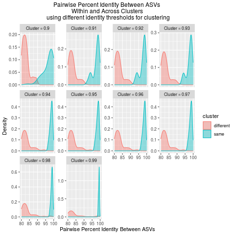
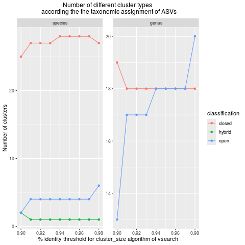

<style>
/* Block console output (<pre>) scrolls horizontally AND vertically */
pre {
  white-space: pre !important;        /* preserve spacing, no wrapping */
  overflow-x: auto !important;        /* horizontal scroll */
  overflow-y: auto !important;        /* vertical scroll */
  display: block;
  max-width: 100%;
  max-height: 500px;                  /* adjust height limit if you want */
  box-sizing: border-box;
}

/* Ensure code inside <pre> also stays fixed and scrollable */
pre code {
  white-space: pre !important;
}

/* TABLES: prevent wrapping, allow horizontal AND vertical scroll */
table {
  display: block;
  overflow-x: auto !important;
  overflow-y: auto !important;
  white-space: nowrap;                /* no wrapping of table cells */
  max-width: 100%;
  max-height: 500px;                  /* adjust as you like */
  box-sizing: border-box;
}
</style>


```{r, include = FALSE}
knitr::opts_chunk$set(
  collapse = TRUE,
  message = TRUE,
  warning = TRUE,
  echo=TRUE,
  eval=FALSE,
  cache=FALSE,
  fig.width = 6,
  out.width = '100%',
  comment = "#>"
)
```

**Package version:** `r packageVersion("vtamR")`


# Tips - Good to Know

## Data Frame or CSV File

Most `vtamR` functions can take either a data frame or a CSV file as input.

This is useful if you want to resume your analysis without rerunning earlier steps.
For example, if you’ve closed your R session but saved your data frame to a file.

### Arguments Accepting Data Frame or CSV

Many function arguments can accept either format, as long as the file or data 
frame contains the required columns. Common examples include:

* `read_count`
* `fastqinfo`
* `fastainfo`
* `sampleinfo`
* `input_asv_list`
* `mock_composition`
* `asv`
* `ltg_params`
* `asv_tax`

Check the **help page** of each function for the exact required columns: `?function_name`.

### Function Outputs

Many functions return a data frame. If you also specify `outfile`, the function 
will write the data frame to a CSV file at the same time.

Saving outputs as CSV is a good practice for long workflows. It allows you to:

* Inspect the dataset after each filtering step
* Resume processing later without rerunning earlier steps

## To Compress or Not to Compress

During the first steps of the workflow 
(`merge_fastq_pairs`, `subsample_fasta`, `trim_primers`, `demultiplex_and_trim_fasta`), 
many intermediate files are generated. Some of these files can be very large, 
especially before dereplication (`dereplicate`).

### File Size vs. Processing Time

Compressing and decompressing files between steps can take significant time. 
For this reason, `vtamR` outputs uncompressed files by default to speed up processing.

However, uncompressed files can quickly consume disk space. 
Remember to delete intermediate files once your analysis is complete. 
See [Files to Keep](#files-to-keep) for guidance on which files to retain.

If storage is limited, you can enable file compression by setting `compress = TRUE` 
in relevant functions (e.g., `subsample_fasta`, `trim_primers`, `demultiplex_and_trim_fasta`). 
This produces **gzip-compressed output files**.

### Compression Methods

The method used is controlled by the `compress_method` argument. 
Three options are available:

* `"pigz"` – Uses the `PIGZ` program (parallel gzip).
  Requires installation, and if not in the system `PATH`, its location must be provided via `pigz_path`.
  Works on Linux-like systems and Windows.
  Uses multithreading, making it the fastest option.

* `"gzip"` – Uses the standard `gzip` command available on Linux-like systems.
  Slower than `pigz` and not available on Windows.

* `"R"` – Implemented in R via the `R.utils` package.
  Cross-platform, works everywhere, but is the slowest method.

### Example: Compression Speed Comparison

For a 19 GB FASTA file (compressed size: 3 GB) on Linux:

| Method  | Compression (min) | Decompression (min) |
| ------- | ----------------: | ------------------: |
| R.utils |                16 |                   3 |
| gzip    |                13 |                   3 |
| pigz    |                 3 |                   2 |

### Summary

* The fastest workflow is to avoid compression during processing and clean up 
intermediate files afterward.
* If you want compressed files, `PIGZ` is clearly the best option.
* See [Installation](installation.html) for setup instructions.

### Notes on Compatibility

The effect of compression may vary depending on which external programs are used:

* CUTADAPT and VSEARCH can often process gzip-compressed files directly.
* On Windows, some VSEARCH commands may not accept compressed files.
* CUTADAPT can produce gzip-compressed outputs on all systems.
* VSEARCH usually outputs uncompressed files, even when reading compressed inputs.

## Detection of False Positives (FP), True Positives (TP), and False Negatives (FN) {#fp-tp-fn}

The function `classify_control_occurrences` identifies occurrences as **false positives**, **false negatives**, or **true positives** based on control samples and habitat context.

- **True Positives (TP):**
  All expected occurrences detected in a mock sample (i.e., ASVs that correspond to the species intentionally included in the mock community).

- **False Negatives (FN):**
  Expected ASVs in the mock samples that are **not detected** during analysis.

- **False Positives (FP):**
  - **Unexpected ASVs** in mock samples (ASVs not included in the mock community).
  - **All ASVs detected in negative controls** (indicating contamination or technical artifacts).
  - **Habitat-inconsistent ASVs:** ASVs detected in a sample but unexpected for its habitat. If samples or mocks originate from distinct habitats (e.g., seawater vs. terrestrial), the function evaluates the proportion of reads for each ASV across habitats. If the proportion of reads for an ASV in a given habitat is below the `habitat_proportion` threshold, the ASV is flagged as a false positive for all samples from that habitat.

## Clustering or Denoising

The `cluster_asv` function supports two algorithms for grouping ASVs:

### Available Methods

**`method = "vsearch"`**
Uses VSEARCH’s `cluster_size` command, a **greedy, centroid-based algorithm**.
ASVs are sorted by decreasing read count, so the most abundant ASVs become cluster centroids.
The cluster radius is controlled by the `identity` parameter.

**`method = "swarm"`**
Uses SWARM, a **fast, iterative algorithm** that clusters ASVs differing by `d` or fewer nucleotides.
Clusters form naturally around local abundance peaks and are mostly insensitive to the input order.

> Although both approaches perform *clustering*, they are often used for **different goals**.

### Denoising vs. Clustering

#### 1. Denoising

SWARM was originally designed as a **denoising** method for metabarcoding data.
The principle is simple:

> True biological ASVs tend to have high read counts, while very similar ASVs with lower read counts are likely sequencing errors.

Denoising groups likely erroneous sequences into the cluster of their true ASV, preserving ASV-level diversity.

Running SWARM with `d = 1` and the *fastidious* option activated corresponds to this denoising goal.

**Limitation:**
If two real biological variants differ by only one mutation, they may be merged, causing some loss of true variability.

**Tip:**
While `cluster_asv` can run SWARM with `d = 1` for denoising, the **`denoise_by_swarm`**
function is specifically designed for this purpose.
It runs SWARM with the same settings but adds a **`split_clusters`** option to 
retain intra-specific variability.
After running SWARM sample by sample, clusters that contain ASVs with 
high relative abundance compared to the centroid can be split, preserving biologically meaningful diversity.

#### 2. Clustering

**Clustering** aims to group ASVs (both true and erroneous) into units 
approximating biological taxa (species, genera, etc.).

* VSEARCH (`cluster_size`) uses a fixed identity threshold for this.
* SWARM with larger `d` values can also produce taxon-like clusters.

Choosing the right threshold depends on the genetic marker and taxonomic group.
`vtamR` provides tools to explore clustering outcomes across multiple thresholds.

### Tools for Choosing a Clustering Threshold

#### 1. Pairwise Identity Plots

For a range of thresholds, `vtamR` can generate density plots of pairwise identities:

* `plot_pairwise_identity_vsearch()` – for VSEARCH thresholds
* `plot_pairwise_identity_swarm()` – for SWARM `d` values

These plots show how ASV similarities vary **within** and **between** clusters.




#### 2. Cluster Classification

Clusters can also be classified based on the **taxonomic assignments** of the ASVs they contain:

* **closed**: All ASVs share the same taxon, and that taxon appears only in this cluster.
* **open**: All ASVs share the same taxon, but the same taxon also appears in other clusters.
* **hybrid**: The cluster contains ASVs assigned to different taxa.

The function `PlotClusterClassification()` shows the number of clusters in each class across thresholds.



### Interpreting the Plots

These visualizations help you choose an appropriate clustering threshold:

* Check if clusters are taxonomically coherent.
* See how identity (`VSEARCH`) or `d` (`SWARM`) affects cluster structure.
* Find a balance between over-splitting and over-merging biological units.

For more guidance, see the [Cluster ASVs into mOTUs](#cluster_asv) section.

## Arguments

### `num_threads` {#num_threads}

By default, vtamR automatically uses all available CPU cores for multithreaded processes.
If you want to maximize performance, there is no need to specify the `num_threads` argument.

However, you may want to limit the number of cores used—for example, to leave resources for other tasks or users.
In that case, simply set the `num_threads` argument in the relevant function.

**Example:**
This limits `merge_fastq_pairs` to use **8 CPU threads**:

```{r, eval=FALSE}
fastainfo_df <- merge_fastq_pairs(
  fastqinfo = fastqinfo, 
  fastq_dir = fastq_dir, 
  vsearch_path = vsearch_path, # can be omitted if VSEARCH is in the PATH
  outdir = merged_dir,
  num_threads = 8
  )
```


### `quiet` {#quiet}

Some external programs used by vtamR can produce a lot of console output, 
even when they are run in their own “quiet” mode.
This can make it hard to spot important warnings or errors.

The `quiet` argument controls whether this output is displayed:

* `quiet = TRUE` (default): suppresses most messages, keeping logs clean.
* `quiet = FALSE`: shows all output, which can be useful for troubleshooting.

**Tip:** If a function fails or behaves unexpectedly, rerun it with 
`quiet = FALSE` to inspect the full messages and identify the problem.

### `sep` {#sep}

The `sep` argument defines the separator used in CSV files.

* Default: `","` (comma)
* Recommendation: Use the same separator in all CSV files to ensure consistency.

**Exception:** The 
[taxonomy](#reference-database-for-taxonomic-assignments-with-assign_taxonomy_ltg)
file of the reference database must be tab-separated (`\t`).

### PATH Variables

Some vtamR functions rely on external programs such as VSEARCH, CUTADAPT, BLAST, SWARM, or PIGZ.
To use these tools, vtamR needs to know where their executables are located.

* If these programs are already in your **system PATH**, vtamR will 
find them automatically.  You don’t need to specify their locations when calling functions.

* If the programs are **not in your PATH**, set a package option for each program:

```{r, eval=FALSE}
options(vtamR.vsearch_path = "C:/Users/Public/vsearch-2.23.0-win-x86_64/bin/vsearch")
options(vtamR.blast_path = "C:/Users/Public/blast-2.16.0+/bin/blastn")
options(vtamR.cutadapt_path = "C:/Users/Public/cutadapt")
options(vtamR.swarm_path = "C:/Users/Public/swarm-3.1.5-win-x86_64/bin/swarm")
options(vtamR.pigz_path = "C:/Users/Public/pigz-win32/pigz")
```

You can also specify the path to the executable using the appropriate 
argument when calling a function. However, this approach is more laborious 
and error-prone, as you need to provide the path each time the function is called.

```{r, eval=FALSE}
merge_fastq_pairs(
  vsearch_path = "C:/Users/Public/vsearch-2.23.0-win-x86_64/bin/vsearch"
  ...
)
```

To see which external tools a function requires, check its help page:
`?function_name`

## Files to Keep

During the preprocessing steps of the workflow (`merge_fastq_pairs`, `random_sample_batch`, `demultiplex_and_trim_fasta`, `demultiplex_and_trim_fastq`, and `trim_primers`), 
many intermediate files are generated. Some of these files can be very large.

Compressing and decompressing files between steps can be time-consuming, so `vtamR` produces uncompressed files by default. You can change this behavior using the [`compress`](#to-compress-or-not-to-compress) option.

The following provides a practical guide on which files to keep, compress, or delete.

### Preprocessing

* **Keep the information files** (`fastainfo.csv` and `fastqinfo.csv`) generated in the output directory. These files contain information about the files and samples processed during the workflow.

* **Keep the files that can be submitted to the SRA.** These are usually the outputs of `demultiplex_and_trim_fastq`, where each pair of files corresponds to a sample replicate and the primers and tags have been removed.

* **Compress subsampled files.** If the files have been subsampled, you can compress them to save disk space. Alternatively, if you have set the `seed` argument, the subsampling is reproducible, so these files can be safely deleted and regenerated if needed.

* **Delete other intermediate files** once you are satisfied that they are no longer needed.

### `dereplicate`

The files generated by `dereplicate` are particularly important because dereplication can be computationally intensive.

* **Keep the dereplicated information file** (e.g., `1_before_filter.csv` in this tutorial).

* **Compress the file after analysis** to reduce its size.

* **Keep this file for reproducibility.** It allows you to restart the analysis from the dereplication step without repeating the potentially time-consuming merging and demultiplexing steps.

* **Keep and compress the updated ASV list** (`ASV_list_with_IDs.csv`). This file can be reused with later datasets to ensure that `asv_id`s remain synchronized across analyses.

### Outputs of filtering steps

* **Compress large files** to save disk space.

* **Keep these files when possible**, as they can be useful for tracing the history of a sample or ASV using [`history_by`](#history_by), or for generating summary files using [`summarize_by`](#summarize_by).

This strategy provides a good balance between disk usage and reproducibility. It preserves the essential files needed to resume analyses, reproduce results, or audit the processing history, while allowing large intermediate files that can be regenerated to be safely removed.


