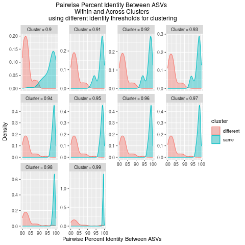
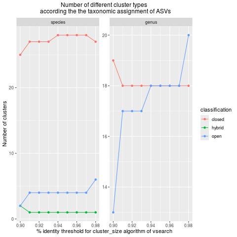

<style>
/* Block console output (<pre>) scrolls horizontally AND vertically */
pre {
  white-space: pre !important;        /* preserve spacing, no wrapping */
  overflow-x: auto !important;        /* horizontal scroll */
  overflow-y: auto !important;        /* vertical scroll */
  display: block;
  max-width: 100%;
  max-height: 500px;                  /* adjust height limit if you want */
  box-sizing: border-box;
}

/* Ensure code inside <pre> also stays fixed and scrollable */
pre code {
  white-space: pre !important;
}

/* TABLES: prevent wrapping, allow horizontal AND vertical scroll */
table {
  display: block;
  overflow-x: auto !important;
  overflow-y: auto !important;
  white-space: nowrap;                /* no wrapping of table cells */
  max-width: 100%;
  max-height: 500px;                  /* adjust as you like */
  box-sizing: border-box;
}
</style>


```{r, include = FALSE}
knitr::opts_chunk$set(
  collapse = TRUE,
  message = TRUE,
  warning = TRUE,
  echo=TRUE,
  eval=TRUE,
  cache=TRUE,
  fig.width = 6,
  out.width = '100%',
  comment = "#>"
)
```

# Summary

**vtamR** is a revised, completed version of 
[VTAM](https://www.csbj.org/article/S2001-0370(23)00034-X/fulltext) 
(Validation and Taxonomic Assignation of Metabarcoding Data) 
rewritten in R. It is a complete metabarcoding pipeline:

* Sequence analyses **from raw fastq files** of amplicon sequences till 
Amplicon Sequence Variant 
([ASV](https://people.imbe.fr/~emeglecz/vtamR/tutorial-vtamr-pipeline.html#glossary)) 
table of **validated ASVs assigned to taxonomic groups**.
* Handles technical or biological **replicates** of the same sample.
* Uses positive and negative **control samples to fine tune the filtering** and 
reduce [false positive](https://people.imbe.fr/~emeglecz/vtamR/tutorial-vtamr-pipeline.html#glossary) 
and [false negative](https://people.imbe.fr/~emeglecz/vtamR/tutorial-vtamr-pipeline.html#glossary) 
occurrences.
* Can pool multiple data sets (results of earlier analyses)
* Can pool results from overlapping markers

**Novelties compared to VTAM:**

* As it is a series of R functions, `vtamR` is highly adaptable to 
include/exclude and order different steps of the analyses
* Includes SWARM for denoising
* Graphic options
* Include functions to get statistics of each filtering steps 
(read and variant count etc.)
* ASV clustering to mOTU 
* The notion of marker and run has been dropped to simplify the analyses

# Installation

Please, follow the [Installation](installation.html) instructions.

# Tutorial

## Set up

**Load library**
```{r setup}
library(vtamR)
```

**Set the path to third-party programs**

If the third-party programs are **not** in your `PATH` 
(see [Installation](installation.html)),
**adjust the `xxx_path` variables** according to your setup.

```{r set_path_win, eval=FALSE}
# Example for Windows
cutadapt_path <- "C:/Users/Public/cutadapt"
vsearch_path <- "C:/Users/Public/vsearch-2.23.0-win-x86_64/bin/vsearch"
blast_path <- "C:/Users/Public/blast-2.16.0+/bin/blastn"
swarm_path <- "C:/Users/Public/swarm-3.1.5-win-x86_64/bin/swarm"
pigz_path <- "C:/Users/Public/pigz-win32/pigz" # optional
```

```{r set_path_linux, eval=FALSE}
# Example for Linux
cutadapt_path <- "~/miniconda3/envs/vtam/bin/cutadapt"
vsearch_path <- "~/miniconda3/envs/vtam/bin/vsearch"
blast_path <- "~/miniconda3/envs/vtam/bin/blastn"
swarm_path <- "swarm" # swarm is in the PATH
pigz_path <- "pigz"   # optional; pigz is in the PATH
```

If the third-party programs **are** in your `PATH`, you have two options:

1. *Define the `xxx_path` variables as shown below*, 
and run the tutorial examples exactly as written.

```{r set_path, eval=TRUE}
# All executables are in the PATH
cutadapt_path <- "cutadapt"
vsearch_path <- "vsearch"
blast_path <- "blastn"
swarm_path <- "swarm"
pigz_path <- "pigz"
```

2. *Do not define the `xxx_path` arguments at all*, 
and simply omit them when calling the `vtamR` functions.

For example, run:

```{r example_wo_path, eval=FALSE}
read_count_df <- FilterChimera(read_count_df)
```

instead of:

```{r example_with_path, eval=FALSE}
read_count_df <- FilterChimera(
  read_count_df,
  vsearch_path = vsearch_path) # can be omitted if VSEARCH is in the PATH
```


**Set general parameters**

```{r general-parameters}
sep <- ","
outdir <- "vtamR_demo_out"
```


* `sep`: Separator used in csv files
* `outdir`: Name of the output directory. Make sure there is **no space in the path**.

**Input Data**

The demo files below are included with the `vtamR` package, which is why we
use `system.file()` to access them in this tutorial. 
When using your own data, simply provide the file and directory names (e.g. `~/vtamR/fastq`)

```{r set-demo-file}
fastq_dir <- system.file("extdata/demo/fastq", package = "vtamR")
fastqinfo <-  system.file("extdata/demo/fastqinfo.csv", package = "vtamR")
mock_composition <-  system.file("extdata/demo/mock_composition.csv", package = "vtamR")
asv_list <-  system.file("extdata/demo/asv_list.csv", package = "vtamR")
```


* `fastq_dir`: Directory containing the input fastq files.
* [fastqinfo](#fastqinfo): CSV file with information on input files, primers, 
tags, samples.
* [mock_composition](#mock_composition): CSV file with expected ASVs in mock samples. 
See [How to make a mock composition file](make-mock-composition-file.html) on
how to create this file.
* [asv_list](#asv_list): CSV file with ASVs and `asv_id`s from earlier data sets. Optional.


**Database for taxonomic assignment**

Set the path to the database for taxonomic assignment 
and to the accompanying taxonomy file.
For this example, we use a **very small database** included in the `vtamR` package.
To see how to get a real database visit [TaxAssign reference data base](installation.html#taxassign-reference-data-base).

When using your own data just enter the file names, without using the 
`system.file` function.

```{r set_db}
taxonomy <- system.file("extdata/db_test/taxonomy_reduced.tsv", package = "vtamR")
blast_db <- system.file("extdata/db_test", package = "vtamR")
blast_db <- file.path(blast_db, "COInr_reduced")
```

* `taxonomy`: CSV file with taxonomic information
* `blast_db`: BLAST database

Details are in [Reference database for taxonomic assignments section](installation.html#reference-database-for-taxonomic-assignments)


**Check the format of input files**

The `CheckFileinfo` function tests if all obligatory columns are present, 
and makes some sanity checks. This can be helpful, since these files are produced 
by the users, and may contain errors difficult to spot by eye.

```{r check-fileinfo}
CheckFileinfo(file=fastqinfo, dir=fastq_dir, file_type="fastqinfo")
CheckFileinfo(file=mock_composition, file_type="mock_composition")
CheckFileinfo(file=asv_list, file_type="asv_list")
```

> **Before starting the analyses, check the [Tips – Good to Know](#tips---good-to-know) section.
> It summarizes several general features and options of `vtamR` and will 
> help you better understand how to run the functions effectively.**


## Merge - Demultiplex

According to your wetlab and sequencing protocol each fastq file can 
contain one or more [sample-replicates](#glossary), and sequences may or may 
not contain [tags](#glossary) (for [demultiplexing](#glossary)) and primer sequences. 

In this tutorial, the fastq files contain reads from several samples, so read pairs 
must be 

- merged and quality filtered (`Merge`)
- demultiplexed and tags and primers trimmed off (`SortReads`)

See the [From fastq to data frame](from-fastq-to-df.html) on
how to deal with other experimental designs.

**Merge and quality filter**

`Merge` will make a single sequence from each read-pair. It can also be used for 
quality filtering.

`compress = FALSE` In the tutorial we will use uncompressed files, but see the
[To compress or not to compress](#to-compress-or-not-to-compress) section to find
the best strategy for you. 

See also [Files to keep](#files-to-keep) on how to handle the 
large intermediate files that should be compressed or deleted once the analyses are complete.

See `?Merge` for more options on quality filtering.

* [fastqinfo](tutorial-vtamr-pipeline.html#fastqinfo): is either a csv file, or a data frame. 
* [fastainfo_df](tutorial-vtamr-pipeline.html#fastainfo): Output of `Merge`. It is the updated 
version of fastqinfo, where fastq file names have been replaced by fasta file 
names and the read counts are included for each file. 


```{r merge}
merged_dir <- file.path(outdir, "merged")

fastainfo_df <- Merge(fastqinfo=fastqinfo, 
                      fastq_dir=fastq_dir, # directory of input fasta files
                      vsearch_path=vsearch_path, # can be omitted if VSEARCH is in the PATH
                      outdir=merged_dir, # directory of output fasta files
                      fastq_maxee=1, # Maximum Expected Error for each read
                      fastq_maxns=0, # no Ns in output
                      fastq_allowmergestagger=T, # reads might be longer than the marker
                      compress=FALSE) # uncompressed output
```


**Randomly select sequences**

The `RandomSeq` function randomly selects `n` sequences (without replacement) 
from each input FASTA file listed in the `fastainfo` data frame.

This step can be useful to **normalize the number of reads across sequencing libraries**,
but it is entirely up to you whether to include it in your workflow.

In this tutorial, I use `RandomSeq` to ensure that all replicate series
(i.e., each FASTA file contains different replicates of the same samples)
contain the same (or similar) number of reads.

There are two different methods to perform random sampling:

1. Using fastx_subsample command of VSEARCH (`use_vsearch = TRUE`). 
This method is very **fast but only available on Linux-like** operating systems.

2. Using R Only (`use_vsearch = FALSE`). This version is slower but 
works on all operating systems.

The following example uses a **slower but cross-platform** version.
See [RandomSeq](#randomseq) for more information.

```{r RandomSeq}
randomseq_dir <- file.path(outdir, "random_seq")

fastainfo_df <- RandomSeq(fastainfo = fastainfo_df, # input df (output of Merge)
                          fasta_dir = merged_dir, # directory of input fasta files.
                          outdir = randomseq_dir,  # directory of output fasta files.
                          use_vsearch  = FALSE, # use cross-platform version
                          n = 40000, # select n sequences from each file
                          compress = FALSE) # uncompressed output
```
A **warning** indicates that the file `mfzr_1_fw.fasta` contains fewer than 40,000 sequences.
Since sampling is performed without replacement, this file is simply copied to 
the output directory and will contain slightly fewer reads than the other two files.

**Demultiplex and Trim**

The `SortReads` function will [demultiplex](#glossary) the fasta 
files according to the [tag](#glossary) combinations and [trim](#glossary) 
the primers from the reads. 

See the help (`?SortReads`) for setting the 
correct parameters for demultiplexing and primer trimming:

* If `check_reverse` is TRUE, `SortReads` checks the reverse complementary stand as well.
* `sampleinfo_df` is  updated version of `fastainfo_df`. 
This data frame and the files listed in it are the input of the `Dereplicate`.

```{r demultiplex}
demultiplexed_dir <- file.path(outdir, "demultiplexed")

sampleinfo_df <- SortReads(fastainfo=fastainfo_df,  # input df (output of RandomSeq)
                           fasta_dir=randomseq_dir, # input directory
                           outdir=demultiplexed_dir,  # output directory
                           check_reverse=TRUE, 
                           cutadapt_path=cutadapt_path, # can be omitted if CUTADAPT is in the PATH
                           vsearch_path=vsearch_path, # can be omitted if VSEARCH is in the PATH
                           cutadapt_minimum_length = 170,
                           cutadapt_maximum_length = 185,
                           compress=FALSE)
```

## Dereplicate

At this stage, you should have **one FASTA file per [sample-replicate](#glossary)**,
containing merged reads with tags and primers removed.

These FASTA files should now be **dereplicated**, 
and each unique sequence ([ASV](#glossary)) will be assigned a numerical ID 
([asv_id](#glossary)). The result is a data frame ([read_count_df](#read_count_df)) 
that can also be written to a **CSV file** if `outfile` is specified. 
Saving this file is recommended, as it serves as the starting point for filtering. 
You can test different filtering strategies starting from this file without 
needing to re-run the time-consuming [merging](#glossary), [demultiplexing](#glossary),
and [trimming](#glossary) steps.

If you wish to retain ASV IDs from a previous analysis, you can provide a 
reference file ([asv_list](#asv_list)) containing earlier ASVs and their IDs. 
The complete, updated list of ASVs will then be written to `output_asv_list`.

If only `output_asv_list` is provided (and `input_asv_list` is omitted), 
the function will write the full list of current ASVs with assigned IDs. 
This will be useful when analyzing further data sets to ensure consistent 
ASV IDs across studies.

```{r derelicate}
outfile <- file.path(outdir, "filter", "1_before_filter.csv")
updated_asv_list <- file.path(outdir, "ASV_list_with_IDs.csv")

read_count_df <- Dereplicate(sampleinfo_df, # input df (output of SortReads)
                             dir=demultiplexed_dir, # directory with input fasta files
                             outfile=outfile, # write the output data frame to this file
                             input_asv_list=asv_list, 
                             output_asv_list=updated_asv_list)
```


## Filter

`vtamR` has a large number of functions to **filter out ASVs** or **occurrences of ASVs**
in a given sample-replicate, which are the results of 
**technical or biological problems associated with metabarcoding**. 

The different filters 

- can be **applied to the original data set** and then the results pooled together 
by using the `PoolFilters` function (accepting only occurrences that pass all filters) 
- or can be **applied sequentially** in the order defined according to your needs.

In this section, I give an example using most filtering options. 
It is up to you to construct your own pipeline.

Each function returns a **data frame with the filtered output**. 
You can also write the results to a **csv file** (using the `outfile` argument). 
This can be useful for tracking 
the presence/absence of some of the ASVs/samples throughout the analyses 
using the [HistoryBy](#historyby) and [SummarizeBy](#summarizeby) functions. 

I will **start the names of the output files by a number** to keep the order 
of the different steps and allow the [SummarizeBy](#summarizeby) function 
to make final statistics at each step of the analyses.

We can also **follow the evolution of the number of reads and ASVs** remaining 
in the data set after each filtering steps. 
Let's define a data frame (`stat_df`), that will contain this information, 
and we will complete it after each step. 

```{r set-stat}
stat_df <- data.frame(parameters=character(),
                      asv_count=integer(),
                      read_count=integer(),
                      sample_count=integer(),
                      sample_replicate_count=integer())
```

Then we add a line with information on the unfiltered data set.

```{r get-initial-stat}
stat_df <- GetStat(read_count_df, stat_df, stage="Input", params=NA)
```

* `params`: String containing the major parameters of each filtering steps.
* `stage`: String referring to the filtering step.


### Denoising with SWARM

In metabarcoding datasets, sequencing errors often generate many low-frequency 
ASVs that do not correspond to real biological sequences. A common way to clean 
this noise is to use **SWARM** ([Mahé et al., 2015](https://peerj.com/articles/1420/)), 
a fast and widely used algorithm that groups highly similar ASVs together.

**Running SWARM in `vtamR`**

You can run SWARM directly using the `denoise_by_swarm()` function.

Since our goal is **denoising** (not clustering into mOTUs), the recommended settings are:

* `swarm_d = 1` (only 1 difference allowed between ASVs)
* `fastidious = TRUE` (a second pass to reduce small clusters)

These settings are specifically designed to remove sequencing errors while keeping real biological variation.

**Whole dataset vs. per-sample clustering**

There are two options:

* `by_sample = FALSE` (default):
  SWARM is applied to the whole dataset. This is more aggressive and reduces 
  ASV numbers efficiently.

* `by_sample = TRUE`:
  SWARM is applied independently to each sample. This is more conservative and 
  helps preserve biological variation.

If you are interested in **intra-specific variability**, it is generally
better to use `by_sample = TRUE`, because very similar real ASVs can otherwise be merged.

**Refining clusters with `split_clusters`**

Even with `d = 1` and `fastidious = TRUE`, SWARM can still group together ASVs that
differ by only one nucleotide but have **similar read abundances**.
In such cases, real biological variants (e.g., intra-specific variants) may 
be merged into a single cluster.

To avoid this issue, `denoise_by_swarm()` provides an optional
post-processing step usig the `split_clusters = TRUE` option.
This step attempts to recover abundant variants that may have been incorrectly merged.

For each cluster:

- ASVs are evaluated based on two criteria:

   * Their read count relative to the cluster centroid (`min_abundance_ratio`)
   * A minimum absolute read count (`min_read_count`)

- ASVs that pass both thresholds are considered biologically meaningful and **each defines a new cluster**.

- The total reads of the original cluster are then redistributed among these ASVs,
while preserving their original proportions

- If no ASV meets the criteria, the cluster is kept as a single unit (reads are pooled)


The `split_clusters` option must be run using the following parameters:

* `by_sample = TRUE` 
* `swarm_d = 1` 
* `fastidious = TRUE` 

```{r swarm}
split_clusters <- TRUE
by_sample <- TRUE
d=1
fastidious= TRUE

outfile <- file.path(outdir, "filter", "2_Swarm_by_sample.csv")

read_count_df <- denoise_by_swarm(read_count_df,# input df
                                  swarm_d=d,
                                  fastidious=fastidious,
                                  by_sample=by_sample,
                                  split_clusters=split_clusters,
                                  swarm_path=swarm_path, # can be omitted if SWARM is in the PATH
                                  outfile=outfile) # write the output data frame to this file

param <- paste(split_clusters, by_sample, fastidious, d)
stat_df <- GetStat(read_count_df, stat_df, stage="SWARM", params=param)
```

Let's check the reduction of the number of variants after running `swarm`.
```{r}
knitr::kable(stat_df, format = "markdown")
```

### LFNglobalReadCount

Although, SWARM has reduced considerably the number of ASVs, there are still 
many ASVs with low read count. 
The `LFNglobalReadCount` function filter out all ASVs with total read count 
bellow a threshold.

Let's eliminate [singletons](#glossary) and see how the number of ASV and reads are have changed.

```{r lfn-global-readcount}
global_read_count_cutoff = 2
outfile <- file.path(outdir, "filter", "3_LFNglobalReadCount.csv")

read_count_df <- LFNglobalReadCount(read_count_df, 
                                    cutoff=global_read_count_cutoff, 
                                    outfile=outfile)

stat_df <- GetStat(read_count_df, 
                   stat_df, 
                   stage="LFNglobalReadCount", 
                   params=global_read_count_cutoff)

knitr::kable(stat_df, format = "markdown")
```

### FilterIndel

This filter is **applicable only for coding sequences**. 
The idea is that if the length of the ASV differs from the most frequent ASV 
length by a number that is not a multiple of 3, it is likely to be an erroneous 
sequence or a pseudo-gene.

```{r filter-indel}
outfile <- file.path(outdir, "filter", "4_FilterIndel.csv")

read_count_df <- FilterIndel(read_count_df, 
                             outfile=outfile)

stat_df <- GetStat(read_count_df, 
                   stat_df, 
                   stage="FilterIndel")

knitr::kable(stat_df, format = "markdown")
```

### FilterCodonStop

This filter is **applicable only for coding sequences**. 
It checks the number of codon STOPs in all 3 reading frames, 
and eliminates ASVs with STOP in all of them.

The numerical id of the genetic code can be chosen from 
[NCBI](https://www.ncbi.nlm.nih.gov/Taxonomy/Utils/wprintgc.cgi?chapter=cgencodes). 
By default, it is the invertebrate mitochondrial genetic code (5), 
since the STOP codons of this genetic codes are also STOP codons in almost all genetic codes.


```{r filter-codon-stop}
outfile <- file.path(outdir, "filter", "5_FilterCodonStop.csv")
genetic_code = 5

read_count_df <- FilterCodonStop(read_count_df, 
                                 outfile=outfile, 
                                 genetic_code=genetic_code)

stat_df <- GetStat(read_count_df, 
                   stat_df, 
                   stage="FilerCodonStop", 
                   params=genetic_code)

knitr::kable(stat_df, format = "markdown")
```


### FilterExternalContaminant

We start from the hypothesis that, in cases of slight external contamination, 
contaminant DNA may be amplified in negative control samples, since there 
is no competition with abundant target DNA. 
Conversely, in real or mock samples, the amplification of contaminant DNA 
is usually less efficient due to this competition.

This filter identifies ASVs whose read counts are higher in at least one 
negative control than in any other sample. 
These ASVs are considered potential contaminants and are removed from the data set.

The `conta_file` will contain the data corresponding to the removed ASVs.
It is a good idea to check its contents to ensure that nothing looks abnormal.
For example, in our case, 8 ASVs were removed. However, they all contain only 
a few reads, so this likely reflects random low-frequency noise rather than 
genuine contamination.

```{r filter-external-contaminant}
conta_file <- file.path(outdir, "filter", "external_contamination.csv")
outfile <- file.path(outdir, "filter", "6_FilterExternalContaminant.csv")

read_count_df <- FilterExternalContaminant(read_count_df, 
                          sampleinfo=sampleinfo_df, 
                          conta_file=conta_file,
                          outfile=outfile)

stat_df <- GetStat(read_count_df, 
                   stat_df, 
                   stage="FilterExternalContaminant", 
                   params=NA)

knitr::kable(stat_df, format = "markdown")
```


### FilterChimera

This function will run the `uchime3_denovo` function implemented in VSEARCH. 

FilterChimera will eliminate ASVs detected as chimeras when running on the 
whole data set at once (`by_sample=FALSE`). 
If `by_sample=TRUE`, ASVs are eliminated if they have been identified as chimeras 
in at least `sample_prop` proportion of the samples where they are present.

`abskew`: A chimera must be at least `abskew` times less frequent that the parental ASVs.


```{r filter-chimera}
abskew=2
by_sample = T
sample_prop = 0.8
outfile <- file.path(outdir, "filter", "7_FilterChimera.csv")

read_count_df <- FilterChimera(read_count_df, 
                               outfile=outfile, 
                               vsearch_path=vsearch_path, # can be omitted if VSEARCH is in the PATH
                               by_sample=by_sample, 
                               sample_prop=sample_prop, 
                               abskew=abskew)

params <- paste(abskew, by_sample, sample_prop, sep=";")
stat_df <- GetStat(read_count_df, 
                   stat_df, 
                   stage="FilterChimera", 
                   params=params)

knitr::kable(stat_df, format = "markdown")
```

### FilterRenkonen

Let's eliminate aberrant replicates that are not similar to other replicates of the same sample. 

We will calculate the renkonen distances among all pairs of replicates within sample.

```{r renkonen-dist}
renkonen_within_df <- MakeRenkonenDistances(read_count_df, compare_all=FALSE)
```

Let's make a density plot of the renkonen distances.

**Note:** This is a very small test data set, so the graph you generate with your 
own data will likely look quite different.

```{r renkonen-dist-density-plot}
DensityPlot_RenkonenDistance(renkonen_within_df)
```

We can also make a barplot of the renkonen distances, and use different colors for different sample types (real/mock/negative).

**Note**:

- `sampleinfo_df` contains a `sample` and `sample_type` columns, but any data frame with these columns would do.
- If you have restarted the analyses after the `SortReads` function, and  
`sampleinfo_df` is not in your environment, just use the sampleinfo 
file (in the `vtamR_demo_out/demultiplexed/` directory).
- This is a very small test data set, so the graph you generate with your 
own data will likely look quite different.

```{r renkonen-dist-barplot}
Barplot_RenkonenDistance(renkonen_within_df, sampleinfo=sampleinfo_df, x_axis_label_size=6)
```
In this example, there are only a few distance values, so the density plot is 
not very informative. The bar plot shows that replicate 1 of the `tnegtag` 
sample (a negative control) differs substantially from the other 
two replicates, and setting `cutoff = 0.4` appears reasonable as a `cutoff`
for the `FilterRenkonen` function.

This command filters out replicates whose Renkonen distances exceed the 
cutoff relative to most other replicates of the same sample. 
In this case, replicate 1 of the `tnegtag` sample will be removed.

An alternative way to determine the cutoff value is to set the 
`renkonen_distance_quantile` parameter instead of specifying a fixed `cutoff`. 
This parameter automatically sets the cutoff at the limit defined by the 
chosen quantile of the within-sample distance distribution. 
For example, setting `renkonen_distance_quantile = 0.9` will set the `cutoff`
between the 9th and 10th decile (i.e., the 90th percentile) of the distance distribution.

Let's choose this option.

```{r filer-renkonen}
outfile <- file.path(outdir, "filter", "8_FilterRenkonen.csv")
renkonen_distance_quantile <- 0.9

read_count_df <- FilterRenkonen(read_count_df, 
                                outfile=outfile, 
                                renkonen_distance_quantile=renkonen_distance_quantile)

stat_df <- GetStat(read_count_df, 
                   stat_df, 
                   stage="FilerRenkonen", 
                   params=renkonen_distance_quantile)

knitr::kable(stat_df, format = "markdown")
```

### FilterPCRerror

If you have done the denoising step by **SWARM** (`ClusterASV`), this function is 
probably redundant.

`FilterPCRerror` filters out an ASV if it is very similar to another, more frequent ASV.
`max_mismatch` argument tells how many mismatches are allowed between a pair of ASV
to be evaluated for PCR error. If the proportion of the read_counts of two similar 
ASVs is less or equal to `pcr_error_var_prop`, the less abundant ASV is flagged 
as a PCR error.

**OptimizePCRerror**

The default value of `pcr_error_var_prop` (0.1) is arbitrary. 
To choose a value adapted to your data set, you can use the
`OptimizePCRerror` function.

`OptimizePCRerror`, will find all highly similar ASV pairs (`max_mismatch=1` by default)
within a mock sample, where one ASV is expected, and the other is not. 
Their `read_count` ratio is printed in the output file. 

The function considers only ASVs with more than `min_read_count` 
reads in the sample to avoid a ratio based on low read counts that are more 
influenced by stochastic events and will be probably filtered out anyway.

See details using the help: `?OptimizePCRerror`. 

**Notes:** 

* I use `max_mismatch=2` in this example, 
to have some output in my very small (and artificial) data set,
but I recommend you to use `max_mismatch=1`.
* If you do not know the exact sequences of the species present in your 
mock samples, and thus, you **do not have the [mock_composition](#mock_composition)
file yet**, read the [How to make a mock_composition file](make-mock-composition-file.html).

```{r optimize-pcr-error}
outfile <- file.path(outdir, "optimize", "OptimizePCRerror.csv")

OptimizePCRerror_df <- OptimizePCRerror(read_count_df, 
                        mock_composition=mock_composition,
                        vsearch_path=vsearch_path, # can be omitted if VSEARCH is in the PATH 
                        outfile=outfile, 
                        max_mismatch=2, 
                        min_read_count=5)
```


Let’s look at the beginning of the output. The lines are sorted in decreasing order of the `pcr_error_var_prop` column, so the first few entries are sufficient to inspect.

```{r optimize-pcr-error-results}
knitr::kable(head(OptimizePCRerror_df), format = "markdown")
```

It seems that SWARM has done a good job. The highest read count ratio is 0.011 
in the output of `OptimizePCRerror`. This should be taken as a lower 
limit to `pcr_error_var_prop`. 

**FilterPCRerror**

Let's use 0.05 for filtering out PCR errors sample by sample.

See the help for more detail `?FilterPCRerror`.

**Note:** Again, I use `max_mismatch <- 2` in this example, since I have used this value
for `OptimizePCRerror`, but I recommend you to use `max_mismatch <- 1`.

```{r filter-pcr-error}
pcr_error_var_prop <- 0.05
max_mismatch <- 2
outfile <- file.path(outdir, "filter", "9_FilterPCRerror.csv")

read_count_df <- FilterPCRerror(read_count_df, 
                                outfile=outfile, 
                                vsearch_path=vsearch_path, # can be omitted if VSEARCH is in the PATH 
                                pcr_error_var_prop=pcr_error_var_prop, 
                                max_mismatch=max_mismatch)

params <- paste(pcr_error_var_prop, max_mismatch, by_sample, sep=";")
stat_df <- GetStat(read_count_df, 
                   stat_df, 
                   stage="FilterPCRerror", 
                   params=params)

knitr::kable(stat_df, format = "markdown")
```

### LFNsampleReplicate

`LFNsampleReplicate` will eliminate occurrences with very low read counts 
compared to the total number of reads in the sample-replicate. 
The default cutoff proportion is 0.001. 
We can have an idea of the maximum value of this cutoff, 
by examining the proportions of expected ASVs in the mock samples using the 
`OptimizeLFNsampleReplicate` function.

**OptimizeLFNsampleReplicate**

**Note**: If you do not know the exact sequences of the species present in your 
mock samples, and thus, you do not have the [mock_composition](#mock_composition)
file yet, read the [How to make a mock_composition file](make-mock-composition-file.html).

```{r optimize-lfn-sample-replicate}
outfile = file.path(outdir, "optimize", "OptimizeLFNsampleReplicate.csv")

OptimizeLFNsampleReplicate_df <- OptimizeLFNsampleReplicate(read_count=read_count_df,
                                                            mock_composition=mock_composition,
                                                            outfile=outfile)

knitr::kable(head(OptimizeLFNsampleReplicate_df), format = "markdown")
```

The lines of `OptimizeLFNsampleReplicate_df` are sorted in 
increasing order of the `lfn_sample_replicate_cutoff` column.
The lowest proportion of read count of an expected ASV to the total read count
of its sample-relicate is 0.0047 
(Sequence of *Caenis pusilla* in the replicate 3 of tpos1 mock sample). 
A cutoff values for `LFNsampleReplicate` higher than this will eliminate some 
of the expected occurrences and create false negatives. 
Therefore, we choose 0.004 as a cutoff.

**Note:** 

If the different species in the mock community are amplified 
equally well, the minimum value of `lfn_sample_replicate_cutoff` 
may be relatively high. In such cases, it is often better to use an 
arbitrarily low value (e.g., 0.001–0.005). 
The optimal threshold depends strongly on the complexity of your 
environmental samples: the more taxa you expect, the lower this cutoff should be.

In practice, strong PCR amplification bias is very common, so situations 
where all mock species amplify equally well are rare.

When designing mock communities for a metabarcoding experiment, it is 
advisable to include some species known to amplify poorly. 
This requires an optimization and testing beforehand, but it ensures that 
your mock sample reflects realistic amplification biases before you process
your actual environmental samples.

**LFNsampleReplicate**

```{r lfn-sample-replicate}
lfn_sample_replicate_cutoff <- 0.004
outfile <- file.path(outdir, "filter", "10_LFNsampleReplicate.csv")

read_count_df <- LFNsampleReplicate(read_count_df, 
                                    cutoff=lfn_sample_replicate_cutoff, 
                                    outfile=outfile
                                    )

stat_df <- GetStat(read_count_df, 
                   stat_df, 
                   stage="LFNsampleReplicate", 
                   params=lfn_sample_replicate_cutoff)

knitr::kable(stat_df, format = "markdown")
```

### FilterMinReplicate 1

To ensure repeatability, occurrences are retained only if they appear in at 
least `min_replicate_number` replicates of the sample (2 by default).

```{r filter-min-replicate}
min_replicate_number <- 2
outfile <- file.path(outdir, "filter", "11_FilterMinReplicate.csv")

read_count_df <- FilterMinReplicate(read_count_df, 
                                    cutoff=min_replicate_number, 
                                    outfile=outfile
                                    )
stat_df <- GetStat(read_count_df, 
                   stat_df, 
                   stage="FilterMinReplicate", 
                   params=min_replicate_number
                   )

knitr::kable(stat_df, format = "markdown")
```

### LFNvariant and LFNreadCount

The `LFNvariant` filter removes occurrences with very low read counts 
relative to the total number of reads of their ASV.
By default, the cutoff proportion is 0.001.

This filter is designed to remove spurious detections caused 
by **tag-jumps** or light **cross-sample contamination**.

The `LFNreadCount` filter, on the other hand, removes occurrences 
with absolute read counts below a fixed threshold, which is set to 10 by default.

**Choosing the best cutoff values**

The function `OptimizeLFNreadCountLFNvariant` helps to determine the most 
appropriate cutoff values for both filters.
It evaluates a range of cutoff combinations and counts the resulting number of
[false positives](#glossary), [false negatives](#glossary), and 
[true positives](#glossary).

To run this optimization, you need a [`known_occurrences_df`](#known_occurrences) 
data frame that identifies occurrences known to be **TPs (true positives)** 
or **FPs (false positives)**.

There are two ways to obtain the `known_occurrences_df`  data frame:

*1. Full control*

You can generate it manually by running the [`MakeKnownOccurrences`](#makeknownoccurrences) 
function. You may then review or edit the resulting `known_occurrences_df` 
as needed before passing it as an input to `OptimizeLFNreadCountLFNvariant`.

*2. Automatic generation*

Alternatively, you can run `OptimizeLFNreadCountLFNvariant` and 
set `known_occurrences = NULL` (the default), but provide values for 
the `mock_composition`, `sampleinfo`, and `habitat_proportion` arguments.
In this case, `OptimizeLFNreadCountLFNvariant` will automatically call 
`MakeKnownOccurrences` and use its output to estimate the optimal cutoff values.

All data frames generated by `OptimizeLFNreadCountLFNvariant` and 
`MakeKnownOccurrences` run from it are written as CSV files 
to the specified `outdir`.

The main output is `OptimizeLFNreadCountLFNvariant_df`, 
which summarizes the performance of the different cutoff combinations. 
This table is also saved in `outdir`.

The rows are ordered by:

1. Increasing number of false negatives (FN),
2. Then increasing number of false positives (FP),
3. Then increasing `lfn_variant_cutoff`,
4. Then increasing `lfn_read_count_cutoff`.

This way, the first line corresponds to the parameter combination that yields 
the lowest number of false negatives and false positives, while also using 
the least stringent values for `lfn_variant_cutoff` and `lfn_read_count_cutoff`.

Let’s use the second approach, where the `known_occurrences_df` is generated 
**automatically** by `OptimizeLFNreadCountLFNvariant`.
If you prefer to create it manually, see the 
[MakeKnownOccurrences](#makeknownoccurrences) section.

Here we will use the default range of cutoffs to test, 
but you can set the minimum, the maximum and the increment for the cutoff 
values for both filters. (see `?OptimizeLFNreadCountLFNvariant`). 
We set `min_replicate_number` to 2, to eliminate non-repeatable 
occurrences among the three replicates of each sample. This is the equivalent of
`FilterMinReplicate` filter.

```{r optimize-lfn-readcount-lfn-variant}
outdir = file.path(outdir, "OptimizeLFNreadCountLFNvariant")

OptimizeLFNreadCountLFNvariant_df <- OptimizeLFNreadCountLFNvariant(
  read_count_df,
  mock_composition = mock_composition,
  sampleinfo = sampleinfo_df,
  habitat_proportion = 0.5,
  known_occurrences=NULL,
  outdir= outdir, 
  min_replicate_number=2
  )

knitr::kable(head(OptimizeLFNreadCountLFNvariant_df), format = "markdown")
```

**LFNvariant, LFNreadCount**

From the output, we choose 0.001 for the cutoff of `LFNvariant` 
and 10 for `LFNreadCount`, since this is the less stringent combination 
that keeps all expected occurrences (6 TP, 0 FN), and has less FP (4 FP).

We will run the two filters on the same input data frame 
(for which the parameters has been optimized), 
and pool the results by accepting only occurrences that pass both 
filters by the `PoolFilters` function.

See `?LFNvariant, ?LFNreadCount` and `?PoolFilters` for details.

LFNvariant
```{r lfn-variant}
lnf_variant_cutoff = 0.001
outfile <- file.path(outdir, "filter", "12_LFNvariant.csv")

read_count_df_lnf_variant <- LFNvariant(read_count_df, 
                                        cutoff=lnf_variant_cutoff, 
                                        outfile=outfile)

stat_df <- GetStat(read_count_df_lnf_variant, 
                   stat_df, 
                   stage="LFNvariant", 
                   params=lnf_variant_cutoff)
```

LFNreadCount
```{r lfn-readcount}
lfn_read_count_cutoff <- 10
outfile <- file.path(outdir, "filter", "13_LFNreadCount.csv")

read_count_df_lfn_read_count <- LFNreadCount(read_count_df, 
                                             cutoff=lfn_read_count_cutoff, 
                                             outfile=outfile)

stat_df <- GetStat(read_count_df_lfn_read_count, 
                   stat_df, stage="LFNreadCount", 
                   params=lfn_read_count_cutoff)
```

Combine results
```{r combine-results}
outfile <- file.path(outdir, "filter", "14_poolLFN.csv")
read_count_df <- PoolFilters(read_count_df_lfn_read_count, 
                             read_count_df_lnf_variant, 
                             outfile=outfile)

stat_df <- GetStat(read_count_df, 
                   stat_df, 
                   stage="FilterLFN")

# delete temporary data frames
rm(read_count_df_lfn_read_count)
rm(read_count_df_lnf_variant)

knitr::kable(stat_df, format = "markdown")
```

### FilterMinReplicate 2

Let's run again `FilterMinReplicate` to ensure repeatability among replicates 
of the sample (2 by default).

```{r filter-min-replicate2}
min_replicate_number <- 2
outfile <- file.path(outdir, "filter", "15_FilterMinReplicate.csv")

read_count_df <- FilterMinReplicate(read_count_df, 
                                    cutoff=min_replicate_number, 
                                    outfile=outfile)

stat_df <- GetStat(read_count_df, 
                   stat_df, 
                   stage="FilterMinReplicate", 
                   params=min_replicate_number)

knitr::kable(stat_df, format = "markdown")
```


### Pool replicates

For each sample, replicates can be pooled. The read count for a given sample 
and ASV can be computed as the mean of non-zero read counts across replicates, 
or alternatively as the sum, maximum, or minimum.

For compatibility with other functions where read_count data frame is used as an input, 
the read_count heading is retained on the output, even when it represents a mean 
or another aggregate across replicates.


```{r filter-min-replicate2}
outfile <- file.path(outdir, "filter", "16_pool_replicates.csv")

read_count_sample_df <- PoolReplicates(
  read_count_df,
  method = "mean",   # Aggregate replicates using the mean read count
  digits = 0,        # Round aggregated read counts to integers
  outfile = outfile
)
```

### Get performance metrics

Run `MakeKnownOccurrences` again to get performance metrics (FP, FN, FP). 
We will write the output data frames to files as well. 
The `performance_metrics` file will give you the count of FP, FN, TP, 
[Precision](#glossary) and [Sensitivity](#glossary). 
You can find false negatives in `missing_occurrences`, 
and true and false positives in `known_occurrences`.

```{r performance-metrics}
missing_occurrences <- file.path(outdir, "Missing_occurrences.csv")
performance_metrics <- file.path(outdir, "Performance_metrics.csv")
known_occurrences <- file.path(outdir, "Known_occurrences.csv")

results <- MakeKnownOccurrences(read_count_sample_df, 
                                sampleinfo=sampleinfo_df, 
                                mock_composition=mock_composition, 
                                known_occurrences=known_occurrences, 
                                missing_occurrences=missing_occurrences,
                                performance_metrics=performance_metrics)

# give explicit names to the 3 output data frames
known_occurrences_df <- results[[1]]
missing_occurrences_df <- results[[2]]
performance_metrics_df <- results[[3]]

knitr::kable(performance_metrics_df, format = "markdown")
```

## Taxonomic Assignment

If you have already assigned ASV to taxa, 
([before making the mock_composition file](make-mock-composition-file.html))
you can use the same output (`asv_tax` data frame) and skip this step.

The `TaxAssignLTG` function is a BLAST base Last Common Ancestor method.
See the brief description of the algorithm with `?TaxAssignLTG`.

For the format of `taxonomy` and `blast_db` check the 
[Reference database for taxonomic assignments](#reference-database-for-taxonomic-assignments-with-taxAssignltg) 
section. You can also download a ready to use COI database 
(See [Installation](installation.html#taxassignltg)).


```{r taxassign}
outfile <- file.path(outdir, "TaxAssignLTG.csv")

asv_tax <- TaxAssignLTG(asv=read_count_sample_df, 
                     taxonomy=taxonomy, 
                     blast_db=blast_db, 
                     blast_path=blast_path, # can be omitted if BLAST is in the PATH
                     outfile=outfile)
```


## Make mOTUs

If you are not interested in intra-specific variation, the ASV can be clustered to mOTUs.

### Algorithm and Clustering parameters

The `ClusterASV` function supports two algorithms for clustering ASVs:

* `method = "vsearch"`: This approach uses VSEARCH’s `cluster_size` command, 
a greedy, centroid-based algorithm that ranks ASVs by decreasing read count. 
As a result, cluster centroids correspond to the most abundant ASVs.
The cluster radius is controlled by the `identity` parameter.

* `method = "swarm"`: SWARM is a fast, iterative clustering method that groups 
ASVs differing by `d` or fewer nucleotides. Clusters form around local 
abundance peaks and are largely unaffected by the order of input sequences.

The main parameters are `identity` for VSEARCH and `swarm_d` for SWARM.
In this tutorial, we’ll focus on determining an appropriate `identity` 
threshold for clustering with VSEARCH, but a similar approach applies to SWARM.

To choose a suitable threshold, you can visualize the distribution of pairwise 
identities between ASVs—comparing pairs within the same cluster versus those 
from different clusters—using the function 
`PairwiseIdentityPlotPerClusterIdentityThreshold` (for VSEARCH).
If you’re clustering with SWARM, see `?PairwiseIdentityPlotPerSwarmD` for the equivalent plot.

For more detailed information, see the [Clustering or denosing](#clustering-or-denoising) section.

```{r PairwiseIdentityPlotPerClusterIdentityThreshold}
outfile <- file.path(outdir, "cluster", "pairwise_identities_vsearch.csv")
plotfile <- file.path(outdir, "cluster", "PairwiseIdentityPlotPerClusterIdentityThreshold.png")

plot_vsearch <- PairwiseIdentityPlotPerClusterIdentityThreshold(
                read_count_sample_df,
                identity_min=0.9,
                identity_max=0.99,
                identity_increment=0.01,
                min_id = 0.8, 
                vsearch_path=vsearch_path, # can be omitted if VSEARCH is in the PATH 
                outfile=outfile, 
                plotfile=plotfile)

print(plot_vsearch)
                                          
```
**Note:** This graph is based on a **very small** test data set and is therefore not informative. 
Below is the graph obtained using the complete (though still relatively small) original data set.



Clusters can also be classified based on the taxonomic assignments of the ASVs they contain:

* `closed`: All ASVs in the cluster are assigned to the same taxon, 
and every ASV belonging to that taxon is found exclusively within this cluster.
* `open`: All ASVs in the cluster share the same taxonomic assignment, 
but additional ASVs of that taxon appear in other clusters.
* `hybrid`: The cluster includes ASVs assigned to multiple taxa.

This classification can be performed after clustering ASVs across a range 
of parameter values for `identity` (VSEARCH) or `swarm_d` (SWARM).
The number of clusters in each category can then be plotted for each parameter setting.
A clustering parameter that maximizes the number of `closed` clusters 
while minimizing the number of `open` and `hybrid` ones is often a good candidate 
for defining mOTUs.

(See `?PlotClusterClassification` for details on setting parameters when using SWARM.)

```{r PlotClusterClasstification}
outfile <- file.path(outdir, "cluster", "classification_vsearch.csv")
plotfile <- file.path(outdir, "cluster", "PlotClusterClasstification_vsearch.png")

scatterplot_vsearch <- PlotClusterClasstification(
                        read_count=read_count_sample_df,
                        taxa=asv_tax,
                        clustering_method="vsearch",
                        cluster_params=c(0.90, 0.91, 0.92, 0.93, 0.94, 0.95, 0.96, 0.97, 0.98, 0.99),
                        vsearch_path=vsearch_path, # can be omitted if VSEARCH is in the PATH
                        taxlevels= c("species", "genus"),
                        outfile=outfile,
                        plotfile=plotfile)

print(scatterplot_vsearch)
                                          
```
**Note:** again, this graph is based on a **very small** test data set and is therefore not informative. 
Below is the graph obtained using the complete (though still relatively small) original data set.



Even the original data set is relatively small, and the graphs do not show strong differences 
between parameter values. Nevertheless, several conclusions can be drawn:

* At clustering thresholds below 0.94, the pairwise identity distribution among 
ASVs within the same cluster becomes bimodal. This likely indicates that 
ASVs from different taxa (species) are being grouped together, 
suggesting the clustering identity threshold should be **at least 0.94**.
* The number of `closed` clusters at the species level is highest between 
**0.94 and 0.97**, while the numbers of `open` and `hybrid` clusters remain 
relatively low in this range.
* Taken together, these results suggest that a clustering threshold 
between **0.94 and 0.97** is appropriate for defining mOTUs as proxies for species.

### Cluster ASVs to mOTUs

The `ClusterASV` function can perform clustering using either VSEARCH 
(`method = "vsearch"`) or SWARM (`method = "swarm"`).

The output format is controlled by the `group` argument:

* `group = TRUE`: ASVs belonging to the same cluster are aggregated into a 
single row. In this case, the `asv_id` and `asv` columns contain the
identifier and sequence of the cluster’s centroid. Read counts are summed 
across ASVs, while sample and replicate structure remain unchanged.
* `group = FALSE`: The function returns the original ASV table with an 
additional `cluster_id` column, so each row still represents a single ASV.

Clustering can be performed on the entire data set or separately for each sample.
When the goal is to define mOTUs, it is recommended to cluster 
all ASVs together (`by_sample = FALSE`).

Attention! If clustering is done by_sample (`by_sample = TRUE`) and 
`group==FALSE`, the same `asv_id`, can have different `cluster_id` in different samples,
therefore this combination is not recommended.

Below, we’ll cluster the data using VSEARCH with an identity threshold of `0.97`.
(See `?ClusterASV` for guidance on adjusting parameters when using SWARM.)

```{r motu-clustersize}
outfile <- file.path(outdir, "filter", "16_mOTU_vsearch.csv")
identity <- 0.97 
read_count_samples_df_ClusterSize <- ClusterASV(
      read_count_sample_df,
      method = "vsearch",
      identity = 0.97,
      group = TRUE,
      by_sample=FALSE,
      path=vsearch_path, # can be omitted if VSEARCH is in the PATH
      outfile=outfile)

stat_df <- GetStat(read_count_samples_df_ClusterSize, 
                   stat_df, 
                   stage="ClusterASV_vsearch",
                   param=identity)

knitr::kable(stat_df, format = "markdown")
```


## Print output

The `WriteASVtable` function restructures the `read_count_df` data frame 
so that **samples are represented in columns** and **ASVs (or mOTU centroids)** 
appear in rows—converting the table from [long format](#glossary) to [wide format](#glossary).

Additional information can be included in the output:

* Taxonomic assignment: (`asv_tax`)
* Totals by ASV: The total number of reads and samples for each ASV (`add_sums_by_asv`)
* Totals by sample: The total number of reads and ASVs for each sample (`add_sums_by_sample`)
* Expected ASVs in mock samples: Adds a column for each mock sample with 
its expected occurrences (`add_expected_asv`)
* Filtered samples: Adds a column for each sample that have been filtered out (`add_empty_samples`)
* Cluster IDs: Retained automatically if present in the input data frame

If `pool_replicates = TRUE`, replicates within each sample are pooled, 
and the read count for each sample is calculated as the mean of non-zero read
counts across replicates.

For further details, see `?WriteASVtable`.

```{r write-asv-table}
outfile=file.path(outdir, "Final_asvtable_with_TaxAssignLTG.csv")

asv_table_df <- WriteASVtable(read_count_sample_df, 
                              outfile=outfile, 
                              asv_tax=asv_tax, 
                              sampleinfo=sampleinfo_df, 
                              add_empty_samples=T, 
                              add_sums_by_sample=T, 
                              add_sums_by_asv=T, 
                              add_expected_asv=T, 
                              mock_composition=mock_composition)
```

Print the number of reads, ASVs, samples and replicates after each step to a CSV file.

```{r}
write.csv(stat_df, file = file.path(outdir, "Summary.csv"))
```

## Multiple datasets

### One marker

Our datasets typically contain sequences obtained from 96 samples, 
corresponding to a 96-well plate used for PCR amplification. 
These include negative controls, mock samples, and biological samples. 
Each set of 96 PCR reactions is processed into a single sequencing library, 
with one library generated per replicate.

For projects involving more than 96 samples, analyses are typically 
performed plate by plate. This approach ensures comparability between sequences 
obtained from different libraries or at different time points 
(e.g., in longitudinal studies monitoring the same sites over time).

The filtered data sets can then be easily pooled using results in long format 
(columns: `asv_id`, `sample`, `replicate` (optional), `read_count`, `asv`). 
In the example below, results from different plates are stored in separate 
directories, each with the same structure and filenames, as they were processed 
independently using the same pipeline.

#### Pool datasets
```{r, eval=FALSE}
filtered_files <- c(
  "plate1/filter/16_pool_replicates.csv", 
  "plate2/filter/16_pool_replicates.csv", 
  "plate3/filter/16_pool_replicates.csv"
)

pooled_read_count_df <- pool_datasets(
  files = filtered_files, 
  outfile = "", 
  method = "mean"  # If a sample appears in multiple plates, take the mean read count
)
```

#### Make mOTUs - pool_dataset

If mOTUs have been generated separately for each plate, the cluster_ids 
(corresponding to the centroid sequences of each cluster) are unlikely to be 
consistent across plates. Therefore, it is better to rerun the clustering 
to define mOTUs on the pooled dataset.

```{r, eval=FALSE}
outfile <- file.path("pooled_dataset", "mOTU.csv")
identity <- 0.97 
read_count_motu <- ClusterASV(
  pooled_read_count_df,
  method = "vsearch",
  identity = 0.97,
  group = TRUE,
  path=vsearch_path, # can be omitted if VSEARCH is in the PATH
  outfile=outfile
  )
```

#### Taxassign pooled data

Although it is possible to extract the taxonomic assignment from the different
TaxAssignLTG.csv file, it is easier to rerun the TaxAssign on the pooled dataset.

```{r, eval=FALSE}
outfile <- file.path("pooled_dataset", "TaxAssignLTG.csv")

asv_tax_pooled <- TaxAssignLTG(
  asv=read_count_motu, 
  taxonomy=taxonomy, 
  blast_db=blast_db, 
  blast_path=blast_path, # can be omitted if BLAST is in the PATH
  outfile=outfile
  )
```

#### Print ASV table

```{r, eval=FALSE}
outfile=file.path("pooled_dataset", "ASVtable_with_taxa.csv")

asv_table_df <- WriteASVtable(
  read_count_motu, 
  outfile=outfile, 
  asv_tax=asv_tax_pooled, 
  add_sums_by_sample=T, 
  add_sums_by_asv=T
  )
```

### More than one overlappig markers

It can be a good idea to use two or more overlapping markers on the same samples 
to increase the taxonomic coverage of PCR amplification.

The data should first be analyzed separately for each marker. 
The results can then be pooled by aggregating ASVs that are identical over 
their overlapping region.

In this example, the pipeline was run on two markers: **MFZR** and **ZFZR**, 
which amplify the same region of the COI gene. However, the MFZR marker 
starts 18 nucleotides upstream of ZFZR. We will use the filtered results 
in long format after pooling replicates within samples, 
although the function works on data including both samples and replicates. 
These files are bundled with the package:

```{r, eval=FALSE}
mfzr_filtered <- system.file("extdata/demo/16_pool_replicates_mfzr.csv", package = "vtamR")
zfzr_filtered <- system.file("extdata/demo/16_pool_replicates_zfzr.csv", package = "vtamR")
```

To avoid confusion between ASV identifiers from the two markers, we assign a 
numerical identifier to each marker (1 for MFZR and 2 for ZFZR). 
These identifiers are appended to the ASV IDs.

```{r, eval=FALSE}
input_files <- c(mfzr_filtered, zfzr_filtered)
marker_ids <- c(1, 2)

# TODO: consider improving file structure
outfile <- file.path(outdir, "pool_markers", "pooled_markers.csv") 
asv_with_centroids <- file.path(outdir, "pool_markers", "pooled_markers_asv_centroids.csv")

pooled_markers <- pool_markers(
  files = input_files,
  marker_ids = marker_ids,
  outfile = outfile,  # ASVs identical over their overlapping region are merged into a single line
  asv_with_centroids = asv_with_centroids,  # same as input, with added centroid_id and centroid
  method = "mean",  # mean read counts across pooled ASVs
  vsearch_path = "vsearch",
  quiet = TRUE
)
```

#### Make mOTU  - Taxassign - ASV table

As previously, for different datasets of the same markers, clustering should be done 
on the pooled data than assigned to taxa.

```{r, eval=FALSE}
#### Cluster
outfile <- file.path(outdir, "pool_markers", "mOTU.csv") 
identity <- 0.97 
read_count_motu <- ClusterASV(
  pooled_markers,
  method = "vsearch",
  identity = 0.97,
  group = TRUE,
  path=vsearch_path, 
  outfile=outfile)

#### TaxAssign
outfile <- file.path(outdir, "pool_markers", "TaxAssignLTG.csv") 

asv_tax_pooled <- TaxAssignLTG(
  asv=read_count_motu, 
  taxonomy=taxonomy, 
  blast_db=blast_db, 
  blast_path=blast_path, 
  outfile=outfile
  )

#### Print ASV table
outfile <- file.path(outdir, "pool_markers", "ASVtable_with_taxa.csv") 

asv_table_df <- WriteASVtable(
  read_count_motu, 
  outfile=outfile, 
  asv_tax=asv_tax_pooled, 
  add_sums_by_sample=T, 
  add_sums_by_asv=T
  )
```


# Tips - Good to know

## Data Frame or CSV File

Most `vtamR` functions can accept either a **data frame** or a **CSV file** as input.
This is a convenient feature that allows you to resume your analysis without 
rerunning previous steps — for example, if you have closed your R session but 
saved the data frame to a file.

Below is a non-exhaustive list of arguments that can take either a data frame or a CSV file,
as long as they contain the required columns:

* `read_count`
* `fastqinfo`
* `fastainfo`
* `sampleinfo`
* `input_asv_list`
* `mock_composition`
* `asv`
* `ltg_params`
* `asv_tax`

See the help of the functions to check for the required columns: `?function_name`

Similarly, many functions return a **data frame**, and if **outfile** is specified at the same time,
the function will also write the data frame to a CSV file.

Saving outputs as CSV files is a good practice for **long workflows**,
as it allows you to inspect the data set after each filtering step and resume 
processing later if needed.


## To Compress or Not to Compress

During the first steps of the workflow (`Merge`, `RandomSeq`, `TrimPrimers`, `SortReads`),
many intermediate files are produced. Some of these can be **very large**, especially 
before dereplication (`Dereplicate`).

**File Size vs. Processing Time**

Compressing and decompressing files between steps can take significant time.
For this reason, **`vtamR` outputs uncompressed files by default** to improve speed.
However, this can quickly consume disk space, so remember to 
**delete intermediate files** once your analysis is complete.
See [Files to keep](#files-to-keep) 
for guidance on which files to retain.

If storage space is limited, you can enable file compression by setting
`compress = TRUE` in the relevant functions (e.g., `RandomSeq`, `TrimPrimers`, `SortReads`).
This will produce **gzip-compressed output files**.

**Compression Methods**

The compression and decompression method is defined by the argument `compress_method`.
Three options are available:

* **`"pigz"`** – Uses the `PIGZ` program (parallel gzip).
  Requires installation and, if not in the system `PATH`, its location must be provided via `pigz_path`.
  Available on Linux-like systems and Windows.
  Uses **multithreading**, making it the **fastest option**.

* **`"gzip"`** – Uses the standard `gzip` command available on Linux-like systems.
  **Slower** than `pigz` and **not available on Windows**.

* **`"R"`** – Fully implemented in R via the **`R.utils`** package.
  **Cross-platform**, works everywhere, but is the **slowest** method.

**Example: Compression Speed Comparison**

The table below shows an example of compression and decompression times
for a 19 GB FASTA file (compressed size: 3 GB) on a Linux system.

| Method  | Compression (min) | Decompression (min) |
| ------- | ----------------: | ------------------: |
| R.utils |                16 |                   3 |
| gzip    |                13 |                   3 |
| pigz    |                 3 |                   2 |

**Summary:**

- The fastest workflow is to **avoid compression during processing** and **clean up intermediate files** afterward.
- If you prefer to work with compressed files, **`PIGZ` is clearly the best option**.
- (See [Installation](installation.html) for setup instructions.)

**Notes on Compatibility**

The effect of compression may vary depending on which external programs are used:

* **CUTADAPT** and **VSEARCH** can directly process gzip-compressed files in most cases.
* On Windows, some **VSEARCH** commands may not accept compressed files.
* **CUTADAPT** can produce gzip-compressed outputs directly on all systems.
* **VSEARCH** typically produces **uncompressed output files**, even when reading compressed inputs.

## Clustering or Denoising

The `ClusterASV` function supports two algorithms for grouping ASVs:

### Available Methods

**`method = "vsearch"`**

Uses VSEARCH’s `cluster_size` command, a greedy centroid-based algorithm.
ASVs are sorted by decreasing read count, so the most abundant ASVs become cluster centroids.
The cluster radius is controlled by the `identity` parameter.

**`method = "swarm"`**

Uses SWARM, a fast, iterative algorithm that clusters ASVs differing by `d` or fewer nucleotides.
Clusters naturally form around local abundance peaks and are mostly insensitive to input order.

Although both approaches perform *clustering*, they are typically used to 
achieve **two different goals**.

### Denoising or clustering

**1. Denoising**

SWARM was originally developed as a **denoising** method for metabarcoding data sets.
The underlying assumption is:

> True biological ASVs tend to have high read counts, while very similar 
ASVs with lower read counts are likely sequencing errors.

With this in mind, denoising attempts to group *erroneous sequences* into the 
cluster of their *true* ASV.

Using SWARM with `d = 1` and with the *fastidious* option activated 
corresponds to this denoising aim.
The output still represents **ASV-level diversity**, not mOTUs.

*Limitation:*
If two real biological variants differ by only one mutation, they may be merged 
into the same cluster, causing a loss of true variability. 
However, SWARM denoising is extremely powerful for removing spurious 
sequences and is recommended early in the bioinformatic pipeline — unless very 
fine-scale intrataxon variation is the focus (e.g., biogeographic studies).

To overcome this problem, the `denoise_by_swarm` can be used with the `split_clusters`
option. In this case after running SWARM sample by sample, clusters can be split 
if they have ASV with high relative abundance compared to the read count of the centroid.
this is strongly recommended, if retaing intra-specific variability is important.


**2. Clustering**

In contrast, **clustering** traditionally aims to group both correct and 
erroneous ASVs into larger units approximating biological taxa (often species or genera).

The simplest clustering approaches rely on a **fixed identity threshold**.
This is the case for the VSEARCH `cluster_size` method.

Although clustering is not SWARM’s original purpose, larger `d` values 
can also produce clusters that approximate taxonomic units.

Choosing an appropriate threshold is difficult, since it depends on both the
genetic marker and the taxonomic group.
To guide this choice, `vtamR` provides tools to examine clustering 
results across multiple thresholds.

### Tools for Choosing a Clustering Threshold

**1. Pairwise Identity Plots**

For a series of thresholds, `vtamR` can produce density plots of pairwise identities:

* `PairwiseIdentityPlotPerClusterIdentityThreshold()`
  (for the thresholds of VSEARCH's `cluster_size`)

* `PairwiseIdentityPlotPerSwarmD()`
  (for SWARM's `d` values)
  

These plots show how ASV similarities vary *within* and *between* clusters.

  

**2. Cluster Classification**

Clusters can also be classified based on their taxonomic assignments:

* *closed*:
  All ASVs in the cluster share the same taxon, and that taxon is absent from all other clusters.
* *open*:
  All ASVs share the same taxon, but the same taxon also appears in other clusters.
* *hybrid*:
  The cluster contains ASVs with different taxa.

The function `PlotClusterClassification()` displays the number of clusters in each 
class for a range of thresholds.


**Interpreting the Plots**

Together, these visualisations help identify an appropriate clustering threshold 
for *your specific dataset*.
They allow you to evaluate:

* whether clusters are taxonomically coherent,
* how identity or `d` values influence cluster structure,
* and where a balance exists between over-splitting and over-merging biological units.

For more information see the [Make mOTUs](#make-motus) section.

## num_threads

By default, **vtamR** automatically uses **all available CPU cores** for multithreaded processes.
If you want to take full advantage of your computer’s resources, there is **no need to specify** the `num_threads` argument.

However, if you wish to **limit the number of cores** used (for example, to leave resources available for other tasks or users),
you can specify this parameter in the functions.

**Example:**
This will restrict vtamR to using 8 CPU threads during running Merge.
```{r, eval=FALSE}
fastainfo_df <- Merge(fastqinfo, 
                      fastq_dir =fastq_dir, 
                      vsearch_path=vsearch_path, # can be omitted if VSEARCH is in the PATH
                      outdir =merged_dir,
                      num_threads =8)
```


## PATH

Some **vtamR** functions rely on **third-party programs** (e.g., VSEARCH, CUTADAPT, BLAST, SWARM, PIGZ).
To run these tools, vtamR needs to know where to find their executables.

If these programs are already available in your **system PATH**,
you don’t need to specify their locations when calling vtamR functions.

However, if they are **not** in your PATH, you must provide their paths explicitly using the corresponding arguments:
`vsearch_path`, `cutadapt_path`, `pigz_path`, `blast_path`, or `swarm_path`.

To check which external programs a function uses, refer to its help page (`?function_name`).

## quiet

Some external programs produce a large amount of output on the screen, even when run in their own “quiet” mode.
This can make it difficult to see important **warnings** or **error messages**.

The `quiet` argument controls whether this output is displayed.
By default, `quiet = TRUE`, which suppresses most messages for cleaner logs.

If something goes wrong, re-run the function with `quiet = FALSE` to view the full output and help identify the problem.


## sep

Separator used in csv files. Comma by default.
Use the same separator in all CSV files 
except for the [taxonomy](#reference-database-for-taxonomic-assignments) 
file of the reference database, which is tab separated.

## Files to keep

At the first steps (`Merge`, `RandomSeq`, `Sortreads`, `TrimPrimer`), many files are produced,
and some of them can be very large, especially before the dereplication 
(`Dereplicate`).

Compressing and decompressing between the different steps can take a while. Therefore, 
`vtamR` uses by default uncompressed files. This behavior can be changed by the 
[compress](#options) option.

Here is a list of files I would tend to keep, delete or compress.

* `Merge`: Delete the output fasta files, but keep `fastainfo.csv` for 
information on read counts after `Merge`.
* `RandomSeq`: Compress fasta files, but keep them to ensure reproducibility 
in case of re-analyse.
* `SortReads`: Delete the output fasta files, but keep `sampleinfo.csv` for 
information on read counts after `SortReads`. 
* `Dereplicate`: Write the dereplicated info to a file 
(`1_before_filter.csv` in the tutorial) and compress it after the analyses. 
This is an important file, since you can restart the analyses from here,
without re-doing the longest merging, and demultiplexing steps. 
Compress and keep the updated ASV list (`ASV_list_with_IDs.csv` in the tutorial), 
since this can be used when analyzing subsequent data sets to synchronyse the `asv_ids`.
* Output of different filtering steps: Compress them if they are too large. 
They are useful for tracing the history of a sample or an ASV 
(see [HistoryBy](#historyby)) or making summary files (see [SummarizeBy](#summarizeby)).


# Supplementary functions

## RandomSeq

The `RandomSeq` function randomly selects `n` sequences (without replacement) 
from each input FASTA file listed in the `fastainfo` data frame.

This step can be useful to normalize the number of reads across sequencing libraries.
`RandomSeq` can be applied before or after demultiplexing (`SortReads`).

However, if your workflow includes `LFNvariant` or `LFNreadCount`, 
which partially rely on the total number of reads in negative controls, 
standardizing read numbers across samples is not recommended.
For this reason, it is generally best to use `RandomSeq` after `Merge` 
and before `SortReads`, in order to ensure that all replicate series 
(i.e., the same samples with different replicates in separate FASTA files) 
contain the same number of reads.

### Available Algorithms

There are two different methods to perform random sampling:

**1. Using VSEARCH (`use_vsearch = TRUE`)**

Random sampling can be done with the [`fastx_subsample`](https://github.com/torognes/vsearch) 
command from VSEARCH.
This method is very fast but only available on Linux-like operating systems.

If compression of input/output files is required, three compression methods are supported:

* **`pigz`** – *Fastest method.* Requires the `PIGZ` program 
(if not in your `PATH`, specify its location via `pigz_path`).
* **`gzip`** – *Slower method.* Works only on Linux-like systems.
* **`R`** – *Slowest but cross-platform method.* Uses the `R.utils` 
package, no external dependencies.

**2. Using R Only (`use_vsearch = FALSE`)**

Random sampling can also be performed entirely in R.
This version is slower but works on all operating systems and does not depend 
on any third-party software for file compression or decompression.

### Input Parameters

* **`fastainfo`**: A CSV file or data frame containing metadata with the following columns:
  `tag_fw`, `primer_fw`, `tag_rv`, `primer_rv`, `sample`, `sample_type`, `habitat`, `replicate`, `fasta`.
* **`fasta_dir`**: Directory containing the input FASTA files.
* **`n`**: Number of sequences to sample (without replacement).
* **`outdir`**: Directory where the output FASTA files will be written.

### Example Commands

**Fast version (Linux-like systems)**

The following example uses VSEARCH and PIGZ for fast compression:

```{r, eval=FALSE}
randomseq_dir <- file.path(outdir, "random_seq")

fastainfo_df <- RandomSeq(
                fastainfo    = fastainfo_df,
                fasta_dir    = merged_dir,
                outdir       = randomseq_dir,
                use_vsearch  = TRUE,
                vsearch_path = vsearch_path, # can be omitted if VSEARCH is in the PATH
                compress_method = "pigz",
                pigz_path    = pigz_path,
                n            = 10000,
                compress     = TRUE)
```

#### Cross-platform version (no external dependencies)

This example runs entirely in R and works on any operating system:

```{r, eval=FALSE}
randomseq_dir <- file.path(outdir, "random_seq")

fastainfo_df <- RandomSeq(
                fastainfo    = fastainfo_df,
                fasta_dir    = merged_dir,
                outdir       = randomseq_dir,
                use_vsearch  = FALSE,
                n            = 10000,
                compress     = TRUE)
```


## MakeKnownOccurrences

The `MakeKnownOccurrences` function will identify [false positive](#glossary), 
[false negative](#glossary) and [true positive](#glossary) 
occurrences in controls samples (mock and negative). 
Some false positives can also be identified in real samples if 
samples of different habitats are included in the data sets. 

The false positive and the true positive occurrences are written to the 
`known_occurrences` data frame (or file), false negatives to the 
`missing_occurrences` data frame (or file), and a `performance_metrics`
data frame is also produced with the count of these occurrences. 
For details see `?MakeKnownOccurrences`.

This function takes a `read_count_df` data frame as an input.

**Note**: 

- If you do not know the exact sequences of the species present in your 
mock samples, and thus, you do not have the [mock_composition](#mock_composition)
file yet, read the [How to make a mock_composition file](make-mock-composition-file.html).
- sampleinfo_df contains a `sample` and `sample_type` `replicate` and `habitat`
columns, but any data frame with these columns would do.
- If you have restarted the analyses after the `SortReads` function, and  
`sampleinfo_df` is not in your environment, just use the sampleinfo 
file (in the `vtamR_demo_out/demultiplexed` directory).
 
```{r make-known-occurrences, eval=FALSE}
# Detect known occurrences
results <- MakeKnownOccurrences(read_count = read_count_df, 
                                sampleinfo=sampleinfo_df, 
                                mock_composition=mock_composition)

# give explicit names to the 3 output data frames
known_occurrences_df <- results[[1]]
missing_occurrences_df <- results[[2]]
performance_metrics_df <- results[[3]]
```

## ASVspecificCutoff

In some data sets, certain ASVs may occur in many samples with high read counts.  
As a result, reads originating from tag-jump or inter sample contamination 
may remain after applying a fixed cutoff value in the `LFNvariant` function.  

The `ASVspecificCutoff` function computes ASV-specific cutoff values for use in `LFNvariant`,  
targeting only ASVs known to have false-positive occurrences (as identified by  
`MakeKnownOccurrences`).  

For each ASV, the function:

* Identifies all false-positive occurrences.
* Takes the maximum read count among these false positives.
* Divides this value by the total read count of the ASV across the data set, 
or within each replicate if `by_replicate = TRUE`.  
   
Because some false positives may not result from tag-jump contamination, the resulting  
cutoff values can sometimes be excessively high. Therefore:

* Filter the data set as thoroughly as possible **before** computing ASV-specific cutoffs.
* Set a reasonable upper limit for these cutoffs using the `max_cutoff` parameter.

```{r, eval=FALSE}
asv_spec <- ASVspecificCutoff(read_count_df, 
                                   max_cutoff=0.05,
                                   mock_composition=mock_composition_df) 
```

The command above produces a data frame (`asv_spec`) containing  
`asv_id` and `cutoff_asv_spec` columns.
Since `max_cutoff = 0.05`, any `cutoff_asv_spec` values greater than 0.05 have been adjusted to 0.05.

The `asv_spec` data frame contains cutoff values only for ASVs with known false-positive occurrences.

These ASV-specific cutoff values can then be used with the `LFNvariant` function 
to filter occurrences. 
If `LFNvariant` has already been applied with a fixed `cutoff`, it is sufficient 
to provide the `asv_spec` data frame. The filtering will be applied only to 
the variants listed in `asv_spec`.

```{r, eval=FALSE}
read_count_df <- LFNvariant(read_count_df, 
                            asv_specific_cutoffs = asv_spec,
                            min_read_count_prop=0.7)
```

A warning is issued by the above command, if for some variants, less than 
`min_read_count_prop` of the reads are retained after filtering. 
This indicates that the cutoff value for those variants was likely too high and 
should be lowered.


It is also possible to use both the `asv_specific_cutoff` and `cutoff` arguments
in `LFNvariant`. 
In this case, the global `cutoff` is applied to all ASVs that do not have an 
ASV-specific cutoff defined in `asv_spec`, as well as to ASVs whose ASV-specific 
cutoff is lower than the global `cutoff`.


```{r, eval=FALSE}
read_count_df <- LFNvariant(read_count_df, 
                            cutoff=0.002,
                            asv_specific_cutoffs = asv_spec,
                            min_read_count_prop=0.7)
```


## TaxAsssignRDP
**Taxonomic assignment using the RDP classifier**

For **16S rRNA** data, the **RDP (Ribosomal Database Project)** provides a 
curated and well-maintained taxonomic reference database.
The **pre-trained set** for **Bacteria** and **Archaea** 16S sequences 
is included in the `rRDPData` package, while the `rRDP` package 
performs rapid taxonomic assignment of these markers.

**Installing `rRDP` and `rRDPData`**

These packages are available through **Bioconductor**, but 
are not installed automatically when installing `vtamR`.
You can install them as follows:

```{r install_rdp, eval=FALSE}
if (!requireNamespace("BiocManager", quietly = TRUE))
    install.packages("BiocManager")

BiocManager::install("rRDP")
BiocManager::install("rRDPData")
```

**Running the RDP classifier via `vtamR`**

The `TaxAssignRDP()` function in vtamR is a wrapper around 
the RDP classifier, making it easy to apply on your ASV data set.

```{r TaxAssignRDP, eval=FALSE}
taxa <- TaxAssignRDP(
  asv=read_count_df,
  max_memory = 8,
  confidence = 0.8,
  rm_chloroplast = TRUE)
```

**Arguments**

* `asv`: Either a CSV file path or a data frame containing at least two columns:
  `asv_id`(unique numeric identifier) and `asv` (nucleotide sequence).
* `max_memory`: Amount of RAM available for RDP (in GB).
* `confidence`: Minimum confidence threshold for taxonomic assignment.
* `rm_chloroplast`: If `TRUE`, lineages of the sequences assigned to *Chloroplast* 
are replaced with `NA` in the taxonomy table.

### Alternative: use your own RDP training set

Instead of the default training set from `rRDPData`, you can specify a 
directory containing a **custom RDP-trained data set** created with the 
`trainRDP()` function.

```{r TaxAssignRDP_custom, eval=FALSE}
taxa <- TaxAssignRDP(
  asv=read_count_df,
  dir="path/to/custom_RDP_trained_DB"
  max_memory = 8,
  confidence = 0.8,
  rm_chloroplast = TRUE)
```

See `?rRDP::rdp` for more details on training and using custom classifiers.

##  HistoryBy

This function scans all files in the `dir` that starts by a number. 
(See file names of the output files of the different [filtering steps](#filter)). 
It will select all lines were the `feature` (`asv_id`/`asv`/`sample`/`replicate`) 
has a `value` we are looking for.

**Examples**

*Get the history of asv_id (`feature`) 27 (`value`).*
```{r}
filter_dir <- file.path(outdir, "filter")
tmp_ASV_27 <- HistoryBy(dir=filter_dir, 
                        feature="asv_id", 
                        value="27")

knitr::kable(head(tmp_ASV_27), format = "markdown")
```

*Get the history of a sequence of the ASV  (`feature`).*
```{r}
tmp_replicate_1 <- HistoryBy(
  dir=filter_dir, 
  feature="asv",
  value="ACTATATTTTATTTTTGGGGCTTGATCCGGAATGCTGGGCACCTCTCTAAGCCTTCTAATTCGTGCCGAGCTGGGGCACCCGGGTTCTTTAATTGGCGACGATCAAATTTACAATGTAATCGTCACAGCCCATGCTTTTATTATGATTTTTTTCATGGTTATGCCTATTATAATC")

knitr::kable(tmp_replicate_1, format = "markdown")
```

*Get the history of the sample (`feature`) tpos1 (`value`).*
```{r}
tmp_sample_tpos1 <- HistoryBy(dir=filter_dir, 
                              feature="sample", 
                              value="tpos1")

knitr::kable(head(tmp_sample_tpos1), format = "markdown")
```


## SummarizeBy

This function scans all files in the `dir` that starts by a number. 
(See file names of the output files of the different [filtering steps](#filter)). 

It will group each file by a variable (`asv`/`asv_id`/`sample`/`replicate`) 
and summarize a `feature` (`asv`/`asv_id`/`sample`/`replicate`/`read_count`). 
If the `feature` is `read_count`, it will give the sum of the read counts 
for each value of the variable in each file. 
Otherwise, it returns the number of distinct values of the `feature` 
for each value of the variable in each file.

**Examples**

*Get the number of reads of each sample after each filtering steps.*

From this data frame, we can see that the negative control sample become 
"clean" after the LFN filters, and there is a considerable variation 
among the number of reads of different real samples.

```{r}
read_count_by_sample <- SummarizeBy(dir=filter_dir, 
                                    feature="read_count", 
                                    grouped_by="sample")

knitr::kable(read_count_by_sample, format = "markdown")
```


*Get the number asv for each sample after each filtering steps.*

From this data frame, we can see that the negative control sample become "clean" 
after the LFN filters, and the mock samples has 10 ASVs at the end.
```{r}
asv_by_sample <- SummarizeBy(dir=filter_dir, 
                             feature="asv", 
                             grouped_by="sample")

knitr::kable(asv_by_sample, format = "markdown")
```


*Get the number asv_id for each replicate after each filtering steps.*

We can see that number of ASVs are comparable in different replicates.
```{r}
asvid_by_replicate <- SummarizeBy(dir=filter_dir, 
                                  feature="asv_id", 
                                  grouped_by="replicate")

knitr::kable(asvid_by_replicate, format = "markdown")
```

## UpdateASVlist

The `UpdateASVlist` function combines unique `asv`–`asv_id` pairs from two 
input data frames or CSV files.

If any inconsistencies are detected within or between the input data sets, 
the function stops and returns an error message.
Otherwise, it writes the merged list of `asv`–`asv_id` pairs to the 
specified output file.

This function ensures consistency between `asv_id`s used in previous and 
current data sets.

The safest approach is to provide both the `input_asv_list` and 
`output_asv_list` arguments directly to the `Dereplicate` function,
as in the [tutorial](#dereplicate).
This approach automatically synchronizes `asv_id`s between the current 
and earliers data sets (`input_asv_list`) and generates an updated ASV list 
that includes all ASVs from both earlier and current data sets (`output_asv_list`).
In this case, you do **not** need to call `UpdateASVlist`
manually — it is automatically invoked within `Dereplicate`.

However, when processing a large number of extensive data sets, the complete ASV 
list can become very large and may cause memory issues.
Because most ASVs in this list are singletons that are later filtered out,
you can choose a lighter workflow:

* Use `input_asv_list` in the `Dereplicate` function to align `asv_id`s with 
previous runs **without** writing an `output_asv_list`.
* After preliminary filtering steps (e.g. `LFNglobalReadCount`), 
update the ASV list to include only frequent ASVs that are more likely to 
reappear in future data sets.

This strategy remains safe and substantially reduces the number of ASVs stored 
in the list file.

#### Example

```{r update-asv-list, eval=FALSE}
asv_list <- "PATH/TO/CSV/WITH/Earlier_asv-asv_id_pairs.csv"
updated_asv_list <- file.path(outdir, "updated_ASV_list.csv")

UpdateASVlist(
  asv_list1 = read_count_df,
  asv_list2 = asv_list,
  outfile = updated_asv_list)
```

## PoolReplicates

Replicates are used to make sure the repetability and reduce experimental
fluctuations, but after the analyse they can be pooled by sample.
It is called automatically from `WriteASVtable`, if `pool_replicates=TRUE`. 

`PoolReplicates` function will take the mean non-zero read counts of each ASV 
over replicates of the same sample.

```{r pool-replicates}
outfile <- file.path(outdir, "PooledReplicates.csv")
read_count_samples_df <- PoolReplicates(read_count_df, 
                                        outfile=outfile)
```

## PoolDatasets

**More than one overlapping marker**

This function pools different data sets and it is particularly useful, 
if the results should be pooled from more than one overlapping markers. 
In that case, ASVs identical on their overlapping regions are pooled into groups, 
and different ASVs of the same group are represented by their centroid 
(longest ASV of the group). Pooling can take the mean read counts of the ASVs 
(`mean_over_markers=T`; default) or their sum (`mean_over_markers=F`).

The function takes several input CSV files, each in [long format](#glossary) 
containing `asv_id`, `sample`, `read_count` and `asv` columns. 
The file names should be organized in data frame, with the marker names for each file.

* `outfile`: Name of the output CSV file with the pooled data set 
(`asv_id`, `sample`, `read_count`, `asv`).
ASVs are grouped to the same line if identical in their overlapping region, 
and only the centroids appear in the `asv` column.
* `asv_with_centroids`: Name of the output CSV file containing each of the the 
original ASVs (with samples, markers, and read_count) as well as their centroids.
* The data frame returned by the function corresponds to the `outfile`.

```{r, eval=FALSE}
files <- data.frame(file=c("vtamR_test/out_mfzr/15_PoolReplicates.csv",
                           "vtamR_test/test/15_PoolReplicates_ZFZR.csv"),
                    marker=c("MFZR", 
                             "ZFZR"))

outfile <- file.path(outdir, "Pooled_datasets.csv") 
asv_with_centroids <- file.path(outdir, 
                                "Pooled_datasets_asv_with_centroids.csv") 

read_count_pool <- PoolDatasets(files, 
                                outfile=outfile, 
                                asv_with_centroids=asv_with_centroids, 
                                mean_over_markers=T,
                                vsearch_path=vsearch_path) # can be omitted if VSEARCH is in the PATH
```

**Only one marker**

Pooling the results of different data sets of the same marker is very simple. 
Basically, the input files (in [long format](#glossary) with 
`asv`, `asv_id`, `sample`, `read_count` columns) are concatenated. 
The `PoolDatasets` function also  checks if sample names are unique. 
If not, it sums the read count of the same sample and same ASV, but returns a warning.

The output file or data frame can be rearranged to [wide format](#glossary) by the [WriteASVtable](#print-output) function.

## CountReadsDir

Count the number of reads in `fasta` or `fastq` files found in the input directory.
Input files can be gz compressed or uncompressed, but zip files are not supported.

The [fastainfo](#fastainfo) and the [sampleinfo](#sampleinfo) 
files contain the number of reads after `Merge` or `SortReads`, 
so no need to run `CountReadsDir` separately. 
This function can be useful for counting the number of reads in the input `fastq` files.

* `dir`: Input directory containing the fasta of fastq files
* `file_type`: [fasta/fastq]
* `pattern`: Regular expression; Check only files for `pattern` in the file name

```{r, eval=FALSE}
df <- CountReadsDir(dir=fastq_dir, 
                    pattern="_fw.fastq.gz", 
                    file_type="fastq")
```
 
## Barplot_ReadCountBySample

Make a bar plot of read counts by [sample](#glossary) (`sample_replicate=F`) 
or [sample-replicate](#glossary) (`sample_replicate=T`).
Can use different colors for different sample types ([real/mock/negative](#glossary))

* [read_count_df](#read_count_df): Input data frame
* `sampleinfo`: data frame or CSV file containing info on sample types for each sample

```{r}
sampleinfo <- file.path(demultiplexed_dir, "sampleinfo.csv")

Barplot_ReadCountBySample(read_count_df=read_count_df, 
                          sample_replicate=F, 
                          sampleinfo=sampleinfo)
```

## Renkonen distances

Calculate the Renkonen distances among all replicates (compare_all=TRUE) 
or among replicates of the same sample (compare_all=FALSE) and plot them.

* [read_count_df](#read_count_df): Input data frame.
* `sampleinfo`: Data frame or CSV file containing info on sample types for each sample.

```{r}
sampleinfo <- file.path(demultiplexed_dir, "sampleinfo.csv")

renkonen_within_df <- MakeRenkonenDistances(read_count_df, 
                                            compare_all=FALSE)

Barplot_RenkonenDistance(renkonen_within_df, 
                         sampleinfo=sampleinfo)

DensityPlot_RenkonenDistance(renkonen_within_df)

renkonen_all_df <- MakeRenkonenDistances(read_count_df, 
                                         compare_all=TRUE)
DensityPlot_RenkonenDistance(renkonen_all_df)
```

 

# I/O files and data frames

## fastqinfo

CSV file with information on input fastq files, primers, tags, 
samples with the following columns. 
Each line corresponds to a sample-replicate combination.

 * tag_fw: Sequence tag on the 5' of the fw read (NA if file is already demultiplexed)
 * primer_fw: Forward primer (NA if primer has been trimmed)
 * tag_rv: Sequence tag on the 3' of the rv read (NA if file is already demultiplexed)
 * primer_rv: Reverse primer (NA if primer has been trimmed)
 * sample: Name of the sample (alpha-numerical)
 * sample_type: [real/mock/negative](#glossary)
 * habitat: If real or mock samples are from different habitats that cannot 
 contain the same type of organisms (e.g. terrestrial vs. marine), 
 this information is used for detecting false positives.
 Use NA otherwise. Use NA for negative controls.
 * replicate: Numerical id of a replicate within sample 
 (e.g. Sample1 can have replicate 1, 2 or 3)
 * fastq_fw: Forward fastq file
 * fastq_rv: Reverse fastq file


## fastainfo

CSV file with information on input fasta files, primers, tags,
samples with the following columns. 
Each line corresponds to a sample-replicate combination.

 * tag_fw: Sequence tag on the 5' of the fw read (NA if file is already demultiplexed)
 * primer_fw: Forward primer (NA if primer has been trimmed)
 * tag_rv: Sequence tag on the 3' of the rv read (NA if file is already demultiplexed)
 * primer_rv: Reverse primer (NA if primer has been trimmed)
 * sample: Name of the sample (alpha-numerical)
 * sample_type: [real/mock/negative](#glossary)
 * habitat: If real or mock samples are from different habitats that 
 cannot contain the same type of organisms (e.g. terrestrial vs. marine), 
 this information is used for detecting false positives. Use NA otherwise. 
 Use NA for negative controls.
 * replicate: Numerical id of a replicate (e.g. Sample1 can have replicate 1, 2 or 3)
 * fasta: Fasta file
 * Read_count: Number of reads in the fasta file. Optional.

## sampleinfo

CSV file with information on demultiplexed and primer trimmed fasta files 
and samples with the following columns. Each line corresponds to a 
sample-replicate combination.

 * sample: Name of the sample (alpha-numerical)
 * sample_type: [real/mock/negative](#glossary)
 * habitat: If real or mock samples are from different habitats that 
 cannot contain the same type of organisms (e.g. terrestrial vs. marine), 
 this information is used for detecting false positives. Use NA otherwise. 
 Use NA for negative controls.
 * replicate: Numerical id of a replicate (e.g. Sample1 can have replicate 1, 2 or 3)
 * fasta: Fasta file
 * Read_count: Number of reads in the fasta file. Optional.

## mock_composition

CSV file with the following columns.

 * sample: Name of the [mock](#glossary) sample
 * action: 
      * keep: Expected ASV in the mock, that should be kept in the data set
      * tolerate: ASV that can be present in a mock, but it is not essential 
      to keep it in the data set (e.g. badly amplified organism)
 * [asv](#glossary): sequence of the ASV
 * taxon: Optional; Name of the organism
 * [asv_id](#glossary): Optional; If there is a conflict between
 asv and asv_id, the asv_id is ignored

## known_occurrences
CSV file or data frame with the following columns.

 * [sample](#glossary): Name of the sample
 * action:
      * keep: Expected ASVs in a mock sample (corresponds to True Positives)
      * delete: False Positive occurrences: unexpected ASV in a mock sample; 
      all occurrences in negative controls; occurrences in real samples 
      corresponding to an incompatible habitats (e.g. an ASV mostly present 
      in marine samples is unexpected in a freshwater sample)
 * [asv_id](#glossary): optional
 * [asv](#glossary): sequence of the ASV
 
## asv_list

This file lists ASVs and their IDs from earlier data sets. When provided 
(optional), identical ASVs in the present and earlier data sets have the 
same ID. New ASVs (not present in asv_list) will get unique IDs not present in asv_list. 
It is a CSV file with the following columns:

 * [asv_id](#glossary): Unique numerical ID of the ASV
 * [asv](#glossary): ASV sequence
 

## read_count_df

Data frame with the following columns:

 * [asv](#glossary): Sequence of the ASV
 * [asv_id](#glossary): Numerical ID of the ASV
 * [sample](#glossary): Sample name
 * [replicate](#glossary): Replicate within sample (Numerical)
 * read_count: Number of reads of the ASV in the Sample-Replicate

## Reference database for taxonomic assignments with TaxAssignLTG

A data base is composed of two elements. A BLAST database (`blast_db`) 
and a `taxonomy` file.

`blast_db` can be produced using the `makeblastdb` command of BLAST:

```{bash, eval=FALSE}
makeblastdb -dbtype nucl -in [FASTA_FILE] -parse_seqids -taxid_map [TAXID_FILE] -out [DB_NAME]
```

 * FASTA_FILE is a fasta file containing reference sequences.
 * TAXID_FILE is a tab separated file with sequence IDs and the 
 corresponding numerical [taxIDs](#glossary).
 * DB_NAME is the name of the newly created BLAST database.

`taxonomy` is a **tab separated** csv file with the following columns:

 * tax_id: Numerical Taxonomic ID. It can be a valid 
 [NCBI taxID](https://www.ncbi.nlm.nih.gov/taxonomy), 
 or arbitrary negative numbers for taxa not in NCBI.
 * parent_tax_id: taxID of the closest parent of tax_id.
 * rank: taxonomic rank (e.g. species, genus, subgenus, no_rank).
 * name_txt: Scientifc name of the taxon.
 * old_tax_id: taxIDs that have been merged to the tax_id by NCBI; 
 if there is more than one for a given tax_id, make one line for each old_tax_id.
 * taxlevel: Integer associated to each major taxonomic rank. 
 (0 => root, 1=> domain, 2=> kingdom, 3=> phylum, 4=> class, 5=> order, 
 6=> family, 7=> genus, 8=> species). 
 Levels in between have 0.5 added to the next highest level 
 (e.g. 5.5 for infraorder and for superfamily).


**A ready to use COI database** in BLAST format and the associated taxonomy 
file can be downloaded from [https://osf.io/vrfwz/](https://osf.io/vrfwz/). 
It was created using [mkCOInr](https://github.com/meglecz/mkCOInr). 
It is also possible to make a [customized database](https://mkcoinr.readthedocs.io/en/latest/content/tutorial.html#customize-database) 
using mkCOInr. It can be dowloaded and extracted manually of using the 
`download_osf` function of vtamR. See [Installation](installation.html)


# Glossary


* **ASV**: Amplicon Sequence Variant. Unique sequence, characterized by 
the number of reads in each sample-replicate.
* **asv_id**: Unique numerical ID of an ASV.
* **demultiplexing**: Sorting reads in a fasta (or fastq) file to different 
sample-replicates according to the tags present at their extremities.
* **dereplication**: The merged reads contain many identical sequences. 
The dereplication reduces the data set to unique sequences (ASV), and count 
the number of reads for each ASV in each sample-replicate.
* **data frame (or csv) in long format**: The `read_count_df` contains one line 
for each occurrence with `asv_id`, `asv`, `sample`, `replicate`, `read_count` columns. 
This is the standard format of keeping occurrences throughout the analyses, 
and it is smaller than the wide format, 
if there are many ASVs present in only one or few samples.
* **data frame (or csv) in wide format**: The `read_count_df` can be rearranged 
in wide format, where lines are ASVs, columns are sample(-replicates) and cells
contain read counts. It is a more human friendly format and it is the base of 
writing an ASV table, where this information can be completed by taxonomic 
assignments and other information.
* **false negative occurrence**: An expected ASV in a mock sample that is not 
found in the data.
* **false positive occurrence**: An unexpected presence an ASV in a Sample.
    * all occurrences in all negative contols, 
    * unexpected occurrences in mock samples
    * presence of an ASV in an incompatible habitat (e.g. ASV with high read 
    count in samples of habitat 1 and low read count in habitat 
    2 is considered as FP in habitat 2).
* **habitat**: Habitat type of the organisms in real or mock samples. 
Use this only if organisms of the different habitats cannot appear in 
another habitat of the data set. Use NA otherwise.
* **long format**: Each row is a single measurement. Typically, 
there are columns like `asv`, `sample`, and `read_count`. This format is tidy 
and works well with many tidyverse functions.
* **Low Frequency Noise (LFN)**: ASVs present in low frequencies, 
likely to be due to errors.
* **merge**: Assemble a forward and reverse read pair to one single sequence.
* **mock sample**: An artificial mix of DNA of know organisms.
* **negative sample**: Negative control.
* **precision**: The proportion of detected positives that are actually true positives (TP/(TP+FP)).
* **real sample**: An environmental sample.
* **replicate**: Technical or biological replicate of a sample. 
Replicates must have numerical identifiers. (e.g. sample tops1 have replicate 1, 2 and 3).
* **sample**: Name of the environmental or control sample. Must be alphanumerical, without space.
* **sample-replicate**: Each sample can have technical of biological replicates. 
sample-replicate refers to one replicate of a given sample.
* **sample_type**: [real/mock/negative](#glossary)
* **sensitivity**: The proportion of real (true) positives that a method successfully detects. (TP/(TP+FN))
* **singleton**: ASV with a single read in the whole data set.
* **tag**: Short sequence at the extremity of the amplicon. 
It is used at the demultiplexing step to identify the sample-replicate, where the read comes from.
* **taxIDs**: Numerical taxonomic identifier. It can be a valid [NCBI taxID](https://www.ncbi.nlm.nih.gov/taxonomy), 
or arbitrary negative numbers for taxa not in NCBI.
* **trimming**: Cut the extremities of the sequences. It can be based on 
sequence quality, or on the detection of a tag or primer.
* **true positive occurrence**: An expected occurrence in a mock sample.
* **Wide format**: In `vtamR` wide format data frames, each row is an ASV, 
and each column represents a sample. Read counts are in the cells.


# Troubleshooting

## Pool different runs of the same samples before filtering

Pooling different sequencing runs may be necessary when the **same samples** 
were sequenced in **multiple runs** 
(e.g., if one sequencing run was of poor quality or if technical replication was done).

It is possible to pool the datasets **before filtering**.

I suggest the following protocol:

### 1. Process each run separately up to the dereplication step

For each sequencing run:

* Merge paired-end reads
* Demultiplex
* Trim primers/adapters

Follow the steps as described in [from-fastq-to-df](from-fastq-to-df.html), 
appropriate for your wet lab and sequencing protocol.

The trimmed, merged, and demultiplexed FASTA files should be stored in a **separate directory for each run**.


### 2. Dereplicate each run separately, while keeping a shared ASV list

Each run should be dereplicated independently. However, to ensure that 
ASV identifiers (`asv_id`) are consistent across runs, you must:

* Use the `output_asv_list` from the first `Dereplicate()` call
* Provide it as `input_asv_list` to the second call
* Then pass the updated list to the third call, and so on

This ensures that:

* ASVs already detected in previous runs retain the same `asv_id`
* Newly detected ASVs receive new identifiers

This step is essential to homogenize ASV identifiers across datasets.

```{r, eval=FALSE}
# Run 1
updated_asv_list1 <- file.path(outdir, "ASV_list_with_IDs_1.csv")

read_count_df1 <- Dereplicate(
  sampleinfo_df1,
  dir = demultiplexed_dir1,
  input_asv_list = "",  # or an existing ASV list
  output_asv_list = updated_asv_list1
)

# Run 2
updated_asv_list2 <- file.path(outdir, "ASV_list_with_IDs_2.csv")

read_count_df2 <- Dereplicate(
  sampleinfo_df2,
  dir = demultiplexed_dir2,
  input_asv_list = updated_asv_list1,
  output_asv_list = updated_asv_list2
)

# Run 3
updated_asv_list3 <- file.path(outdir, "ASV_list_with_IDs_3.csv")

read_count_df3 <- Dereplicate(
  sampleinfo_df3,
  dir = demultiplexed_dir3,
  input_asv_list = updated_asv_list2,
  output_asv_list = updated_asv_list3
)
```


### 3. Pool the dereplicated datasets

Once dereplication is complete and ASV identifiers are harmonized across runs, 
the resulting `read_count_df` objects can be pooled.

```{r, eval=FALSE}
read_count_df <- rbind(read_count_df1, read_count_df2, read_count_df3) %>%
  group_by(asv_id, sample, replicate, asv) %>%
  summarize(read_count = sum(read_count), .groups = "drop")
```

This step:

* Combines the runs
* Sums read counts for identical ASV–sample–replicate combinations
* Produces a unified dataset ready for downstream filtering


## LFNvariant eliminate most occurrences of a frequent ASV

`LFNvariant` will filter out all occurrences where

`(number of reads of the ASV in a sample-replicate) / (total number of read of the ASV) < cutoff` 

As a consequence, if an ASV is present in most samples, there are many samples 
in the data set and the cutoff is relatively high, most occurrences can fall 
bellow the cutoff and the total read count of the ASV will decrease strongly at this step.

If the proportion of the read count of an ASV in the output compared to 
the input is less than `min_read_count_prop`, vtamR prints out a Warning. 
Take a close look at the variant. It can be the result of a general contamination, 
and in this case, the whole ASV could/should be eliminated from the data set. 
Otherwise, you might want to reduce the cutoff value for `LFNvariant`.

## Memory issues for running swarm on the whole data set

Possible workarounds:

* Try to run SWARM sample by sample (`by_sample=T`). 
* Run `global_read_count` first to eliminate singletons then swarm. 

Both solutions make swarm a bit less efficient, but at least your analyses can get through.

## Memory issues in Merge on Windows

If input fastq files are very large and do not go through `Merge`, 
Try working with uncompressed input files.

## No or few sequences passing merge

If the amplicon is shorter than the reads, use `fastq_allowmergestagger=T`.
